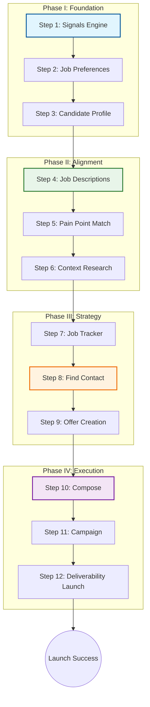

# RoleFerry Workflow & Navigation Architecture - Week 6

## 1. Executive Summary

The RoleFerry platform has evolved into a structured, 12-step linear workflow designed to guide job seekers from **discovery** to **execution**. This document details the logical flow implemented during Week 6, justifies the navigation design choices, and provides a visual representation of the user journey.

The core philosophy of the navigation is **"The Funnel Approach"**:
1.  **Broad Context (Steps 1-3):** Establishing who the candidate is and what they want.
2.  **Opportunity Isolation (Steps 4-6):** Narrowing down to a specific job and aligning skills.
3.  **Targeting & Strategy (Steps 7-9):** Identifying decision-makers and crafting the value proposition.
4.  **Execution (Steps 10-12):** delivering the message and managing the campaign.

---

## 2. Detailed Workflow Steps

### Phase I: Foundation & Discovery
*Establishing the baseline for the job search.*

*   **Step 1: Signals Engine**
    *   **Purpose:** Discover high-intent opportunities before they are posted on job boards.
    *   **Action:** User filters by signal type (Funding, Expansion) to find companies.
    *   **Justification:** Starting here is proactive. It shifts the mindset from "applying" to "hunting."

*   **Step 2: Job Preferences**
    *   **Purpose:** Define the criteria for an ideal role (Salary, Location, Values).
    *   **Action:** User selects hard constraints and soft preferences.
    *   **Justification:** These settings act as global filters for subsequent AI recommendations.

*   **Step 3: Candidate Profile (Load Resume)**
    *   **Purpose:** Ingest the user's professional history.
    *   **Action:** User uploads a resume; AI extracts Metrics, Challenges Solved, and History.
    *   **Justification:** This data is the "source of truth" used for variable substitution in outreach emails later.

### Phase II: Alignment & Analysis
*Deep diving into a specific opportunity.*

*   **Step 4: Job Descriptions**
    *   **Purpose:** Import and analyze a specific job posting.
    *   **Action:** User pastes a JD or URL. AI grades the role (Shoo-in vs. Stretch) and extracts jargon.
    *   **Justification:** This step anchors the rest of the flow to a single "target," allowing for tailored outreach.

*   **Step 5: Pain Point Match**
    *   **Purpose:** Map candidate skills directly to client problems.
    *   **Action:** AI compares the JD (Step 4) with the Resume (Step 3) to identify specific "Pain Points" and suggested "Solutions."
    *   **Justification:** This is the core value prop. It transforms a generic application into a consultative pitch.

*   **Step 6: Context Research**
    *   **Purpose:** Gather intelligence on the company and culture.
    *   **Action:** AI summarizes recent news, tech stack, and cultural values.
    *   **Justification:** "Show you know them." This data fuels the "Why Us?" portion of the email.

### Phase III: Strategy & Targeting
*Preparing the attack plan.*

*   **Step 7: Job Tracker**
    *   **Purpose:** Pipeline management.
    *   **Action:** User moves the opportunity into "Wishlist" or "Applied" status.
    *   **Justification:** Provides a visual overview of progress and prevents opportunities from slipping through the cracks.

*   **Step 8: Find Contact**
    *   **Purpose:** Identify the hiring manager or decision-maker.
    *   **Action:** AI suggests contacts based on the JD level and department.
    *   **Justification:** Applications go to black holes; emails go to people. Finding the *right* person is critical.

*   **Step 9: Offer Creation**
    *   **Purpose:** Draft the core "Hook" or "Pitch."
    *   **Action:** User selects a tone (e.g., "Startup", "Enterprise") and drafts the value proposition snippet.
    *   **Justification:** Separating the "Pitch" from the "Email" ensures the core message is solid before worrying about email formatting.

### Phase IV: Execution
*Launching the outreach.*

*   **Step 10: Compose**
    *   **Purpose:** Assemble the final email assets.
    *   **Action:** AI combines the Offer, Context, and Pain Points into a personalized email. Jargon is simplified.
    *   **Justification:** This is where all previous steps converge into a deliverable artifact.

*   **Step 11: Campaign**
    *   **Purpose:** Structure the follow-up sequence.
    *   **Action:** User defines the multi-touch cadence (Day 1, Day 3, Day 7).
    *   **Justification:** One email is rarely enough. Automated sequencing increases reply rates significantly.

*   **Step 12: Deliverability Launch**
    *   **Purpose:** Final pre-flight checks.
    *   **Action:** System checks DNS, spam scores, and domain health before sending.
    *   **Justification:** Prevents the "Spam Folder" tragedy. Ensures the effort of the previous 11 steps isn't wasted.

---

## 3. Navigation Flow Diagram

## 4. Justification of Navigation Choices

### A. The "Home Icon" Anchor
We replaced the varying "Back" buttons with a consistent **Home Icon** in the top-left of every wireframe.
*   **Argument:** Users explore non-linearly. They might jump from "Offer Creation" back to "Context Research" to check a fact. A consistent "Home" anchor provides a safety hatch, reducing cognitive load and fear of getting "stuck" in a deep workflow.

### B. Linear "Next Step" Progression
While random access is allowed via the Home menu, the primary call-to-action (CTA) on every page is a "Next Step" button (e.g., "Compose ->").
*   **Argument:** Job searching is overwhelming. By enforcing a default linear path (1 through 12), we reduce decision fatigue. The user doesn't have to ask "What do I do next?"; the interface tells them.

### C. Persistent "Step X of 12" Indicator
We restored the progress indicator on every screen.
*   **Argument:** Gamification psychology. Seeing "Step 9 of 12" creates a "Goal Gradient Effect," motivating the user to finish the sequence because they are close to the end. It provides a sense of accomplishment and orientation.

### D. Mock Data vs. Loading States
We removed "Loading..." spinners in favor of instant Mock Data in wireframes.
*   **Argument:** For demos and user testing, friction kills momentum. Waiting for a fake API call adds no value. Showing realistic data (e.g., "Jane Doe, VP of Engineering") immediately allows the stakeholder to evaluate the *layout* and *value* of the screen without distraction.

### E. "Pain Point" Refactor
We renamed "Pinpoint Match" to "Pain Point Match".
*   **Argument:** Clarity and Standard Industry Terminology. "Pain Point" is a universally understood concept in sales and consulting (identifying the client's problem). "Pinpoint" is ambiguous. Using specific language helps users understand that this step is about *solving problems*, not just precise targeting.

