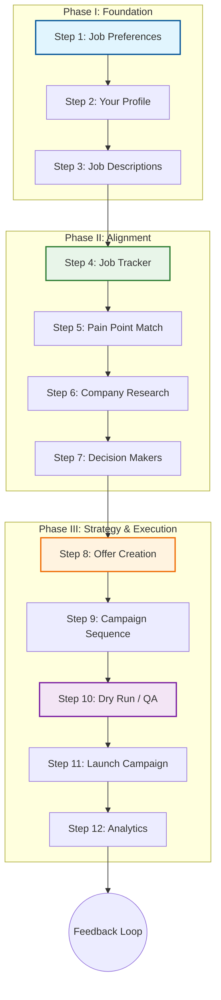

# RoleFerry Workflow & Navigation Architecture - Week 7

## 1. Executive Summary

The RoleFerry platform has evolved into a structured, 12-step linear workflow designed to guide job seekers from **discovery** to **execution**. This document details the logical flow implemented during Week 7, justifies the navigation design choices, and provides a visual representation of the user journey.

The core philosophy of the navigation is **"The Funnel Approach"**:
1.  **Broad Context (Steps 1-3):** Establishing who the candidate is and what they want.
2.  **Opportunity Isolation (Steps 4-7):** Narrowing down to a specific job, aligning skills, and researching the company/people.
3.  **Strategy & Crafting (Steps 8-9):** Creating the perfect message and sequence.
4.  **Execution & Review (Steps 10-12):** Validating, launching, and tracking.

---

## 2. Detailed Workflow Steps

### Phase I: Foundation & Discovery
*Establishing the baseline for the job search.*

*   **Step 1: Job Preferences**
    *   **Purpose:** Define the criteria for an ideal role (Salary, Location, Values, Industries).
    *   **Action:** User selects hard constraints and soft preferences (now expanded with granular industries/roles).
    *   **Justification:** These settings act as global filters for subsequent AI recommendations.

*   **Step 2: Your Profile (Resume)**
    *   **Purpose:** Ingest the user's professional history.
    *   **Action:** User uploads a resume; AI extracts "Five Aspects" (Metrics, Challenges, Accomplishments, Tenure, Positions).
    *   **Justification:** This data is the "source of truth" used for variable substitution in outreach emails later.

*   **Step 3: Job Descriptions**
    *   **Purpose:** Import and analyze a specific job posting.
    *   **Action:** User pastes a JD or URL. AI grades the role (Easiest / Stretch / Ideal) and extracts jargon.
    *   **Justification:** This step anchors the rest of the flow to a single "target," allowing for tailored outreach.

### Phase II: Alignment & Analysis
*Deep diving into a specific opportunity.*

*   **Step 4: Job Tracker**
    *   **Purpose:** Pipeline management.
    *   **Action:** User moves the opportunity into "Saved", "Applied", etc.
    *   **Justification:** Moving this earlier in the flow (before research) allows users to "save" promising JDs immediately before investing time in deep research.

*   **Step 5: Pain Point Match**
    *   **Purpose:** Map candidate skills directly to client problems.
    *   **Action:** AI compares the JD (Step 3) with the Resume (Step 2) to identify specific "Pain Points" and matching "Solutions".
    *   **Justification:** This is the core value prop. It transforms a generic application into a consultative pitch.

*   **Step 6: Company Research**
    *   **Purpose:** Gather intelligence on the company, culture, and buying signals.
    *   **Action:** AI summarizes recent news, funding events (Signals), and cultural values.
    *   **Justification:** "Show you know them." This data fuels the "Why Us?" portion of the email.

*   **Step 7: Decision Makers**
    *   **Purpose:** Identify the hiring manager or decision-maker.
    *   **Action:** AI suggests contacts and finds "Interesting Facts" for icebreakers.
    *   **Justification:** Applications go to black holes; emails go to people. Finding the *right* person is critical.

### Phase III: Strategy & Execution
*Crafting and launching the outreach.*

*   **Step 8: Offer Creation**
    *   **Purpose:** Draft the core email message using all upstream variables.
    *   **Action:** User selects a tone (e.g., "Flattery", "Mentorship") and generates the initial email.
    *   **Justification:** Merges the old "Compose" step here to streamline the process.

*   **Step 9: Campaign Sequence**
    *   **Purpose:** Structure the follow-up sequence.
    *   **Action:** User defines the 4-step cadence (Intro, Nudge, Value, Final).
    *   **Justification:** One email is rarely enough. Automated sequencing increases reply rates significantly.

*   **Step 10: Dry Run / QA**
    *   **Purpose:** Final visual check of the entire thread.
    *   **Action:** User previews all 4 emails in a scrollable thread view and edits if needed.
    *   **Justification:** Gives the user confidence that the sequence flows logically before pulling the trigger.

*   **Step 11: Launch Campaign**
    *   **Purpose:** Final pre-flight checks and execution.
    *   **Action:** System checks DNS, spam scores, and domain health before sending.
    *   **Justification:** Prevents the "Spam Folder" tragedy.

*   **Step 12: Analytics**
    *   **Purpose:** Track results and optimize.
    *   **Action:** Dashboard showing Open Rates, Reply Rates, and Pipeline Value.
    *   **Justification:** Feedback loop for the user to improve their approach.

---

## 3. Navigation Flow Diagram

## 4. Justification of Navigation Choices

### A. The "Home Icon" Anchor
We replaced the varying "Back" buttons with a consistent **Home Icon** in the top-left of every wireframe.
*   **Argument:** Users explore non-linearly. A consistent "Home" anchor provides a safety hatch.

### B. Linear 12-Step Path
We consolidated the flow into a clear 12-step path.
*   **Argument:** Reduces decision fatigue. The "Next Step" is always obvious.

### C. "Pain Point" Refactor
We renamed "Pinpoint Match" to "Pain Point Match".
*   **Argument:** Clarity and Standard Industry Terminology. It emphasizes solving the client's problem.

### D. Global Feedback
"Give Feedback" is available globally rather than being a forced Step 13.
*   **Argument:** Users should be able to provide feedback at any point in the journey without breaking their flow.

