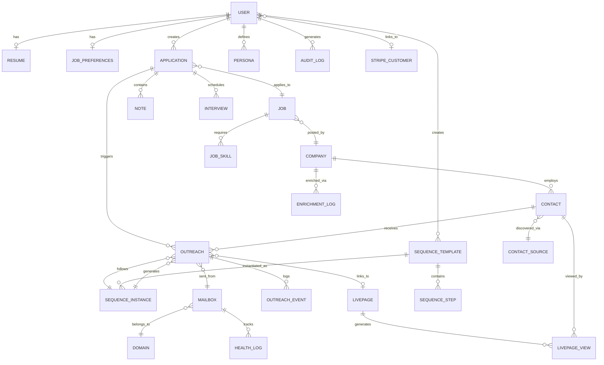

# Data Model - Entity Relationship Diagram
## RoleFerry Platform

**Version**: 1.0  
**Audience**: Backend Engineers, Database Administrators, Product  
**Purpose**: Visual representation of data relationships

---

## 1. Complete ERD (Mermaid)



---

## 2. Core Entities

### USER (Central Entity)
**Attributes**:
- id (PK)
- email (unique)
- hashed_password
- mode (job_seeker | recruiter)
- subscription_tier (free | pro | teams | enterprise)

**Relationships**:
- HAS ONE Resume
- HAS ONE JobPreferences
- CREATES MANY Applications
- CREATES MANY SequenceTemplates
- GENERATES MANY AuditLogs

---

### APPLICATION (Pipeline Record)
**Attributes**:
- id (PK)
- user_id (FK → User)
- job_id (FK → Job)
- status (saved | applied | interviewing | offer | rejected)
- match_score (0-100)

**Relationships**:
- BELONGS TO User
- APPLIES TO Job
- TRIGGERS MANY Outreach events
- CONTAINS MANY Notes

---

### OUTREACH (Email Send Event)
**Attributes**:
- id (PK)
- application_id (FK → Application)
- contact_id (FK → Contact)
- sequence_instance_id (FK)
- status (queued | sent | delivered | bounced | replied)

**Relationships**:
- BELONGS TO Application
- TARGETS Contact
- SENT FROM Mailbox
- FOLLOWS SequenceInstance
- LINKS TO LivePage (optional)

---

## 3. Entity Cardinality

| Relationship | Cardinality | Example |
|--------------|-------------|---------|
| User → Resume | 1:1 | Each user has one resume |
| User → Applications | 1:N | User applies to many jobs |
| Application → Outreach | 1:N | Application sends emails to multiple contacts |
| Contact → Outreach | 1:N | Contact receives emails from multiple applications |
| Mailbox → Outreach | 1:N | Mailbox sends many emails |
| SequenceTemplate → SequenceInstance | 1:N | Template used for many campaigns |

---

## 4. Referential Integrity

### Cascade Deletes
```sql
-- When User deleted → Cascade to dependent records
ALTER TABLE resumes ADD CONSTRAINT fk_resume_user
    FOREIGN KEY (user_id) REFERENCES users(id) ON DELETE CASCADE;

ALTER TABLE applications ADD CONSTRAINT fk_application_user
    FOREIGN KEY (user_id) REFERENCES users(id) ON DELETE CASCADE;

-- When Application deleted → Cascade to Outreach
ALTER TABLE outreach ADD CONSTRAINT fk_outreach_application
    FOREIGN KEY (application_id) REFERENCES applications(id) ON DELETE CASCADE;
```

### Restrict Deletes
```sql
-- Prevent deleting Job if Applications exist
ALTER TABLE applications ADD CONSTRAINT fk_application_job
    FOREIGN KEY (job_id) REFERENCES jobs(id) ON DELETE RESTRICT;
```

---

## 5. Indexes for Performance

### High-Frequency Queries

**Get User Applications**:
```sql
CREATE INDEX idx_application_user_status ON applications(user_id, status, last_action_at DESC);
```

**Find Queued Outreach**:
```sql
CREATE INDEX idx_outreach_queued ON outreach(status, queued_at) WHERE status = 'queued';
```

**Select Available Mailbox**:
```sql
CREATE INDEX idx_mailbox_available ON mailboxes(status, health_score, sent_today, daily_cap)
    WHERE status = 'active' AND health_score >= 70 AND sent_today < daily_cap;
```

---

## 6. Acceptance Criteria

- [ ] ERD covers all entities and relationships
- [ ] Cardinality correct (1:1, 1:N, N:M)
- [ ] Foreign keys defined with cascade/restrict rules
- [ ] Indexes cover high-frequency queries
- [ ] ERD reviewed by backend team + DBA
- [ ] ERD synced with actual database schema

---

**Document Owner**: Database Architect, Backend Lead  
**Version**: 1.0  
**Date**: October 2025  
**Next Review**: Quarterly (as schema evolves)

