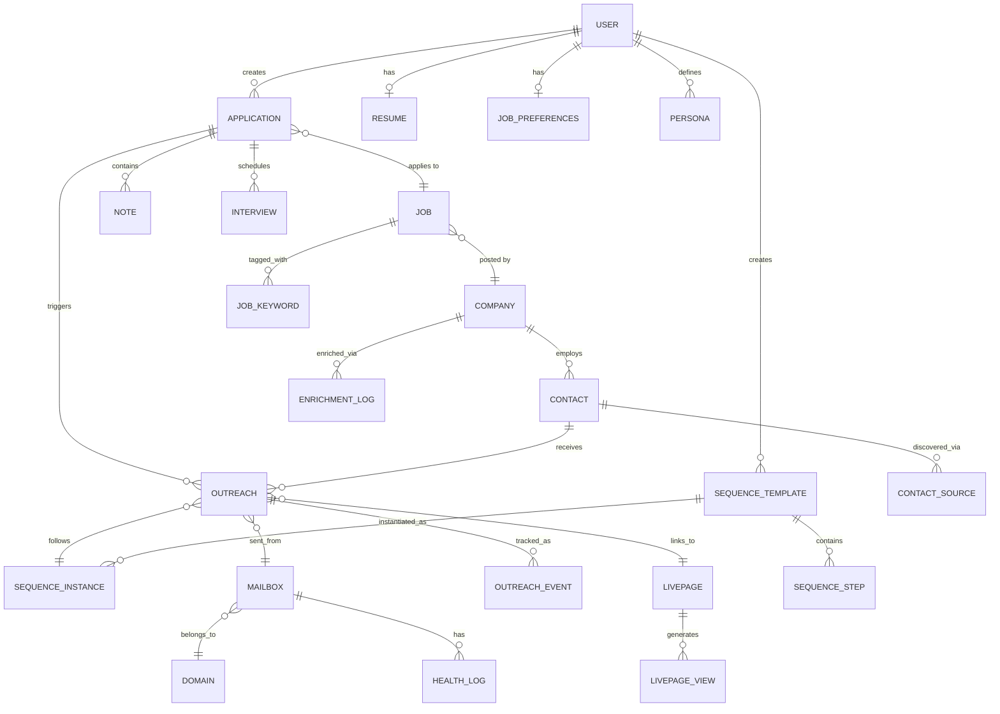

# Data Architecture: Logical Level
## RoleFerry Platform

**RM-ODP Viewpoints**: Information, Computational (Logical)  
**Audience**: Data Architects, Database Engineers, Backend Developers  
**Purpose**: Logical data model, query patterns, data services

---

## 1. Logical Data Model

### 1.1 Entity-Relationship Diagram (Detailed)



### 1.2 Table Specifications

#### USER
| Column | Type | Constraints | Index | Purpose |
|--------|------|-------------|-------|---------|
| id | SERIAL | PRIMARY KEY | B-tree | Unique identifier |
| email | VARCHAR(255) | UNIQUE, NOT NULL | B-tree | Login, contact |
| hashed_password | VARCHAR(255) | NULL | - | Auth (null for OAuth) |
| full_name | VARCHAR(255) | - | - | Display name |
| mode | ENUM | NOT NULL | - | job_seeker / recruiter |
| subscription_tier | VARCHAR(50) | NOT NULL | - | free / pro / teams |
| credits_remaining | INTEGER | DEFAULT 0 | - | Enrichment credits |
| created_at | TIMESTAMP | DEFAULT NOW() | B-tree | Registration date |
| last_login | TIMESTAMP | - | - | Activity tracking |
| email_verified | BOOLEAN | DEFAULT FALSE | - | Email confirmation |
| stripe_customer_id | VARCHAR(255) | UNIQUE | - | Payment integration |

**Indexes**:
```sql
CREATE INDEX idx_user_email ON users(email);
CREATE INDEX idx_user_created_at ON users(created_at DESC);
CREATE INDEX idx_user_subscription ON users(subscription_tier);
```

---

#### RESUME
| Column | Type | Constraints | Purpose |
|--------|------|-------------|---------|
| id | SERIAL | PRIMARY KEY | Unique identifier |
| user_id | INTEGER | FOREIGN KEY, UNIQUE | One resume per user |
| roles | JSONB | - | [{"title": "PM", "company": "X", "tenure": "3y"}] |
| key_metrics | JSONB | - | ["Reduced TTH by 30%", ...] |
| accomplishments | JSONB | - | Achievement bullets |
| skills | JSONB | - | ["Python", "Product Strategy"] |
| raw_text | TEXT | - | Original resume OCR |
| pdf_url | VARCHAR(500) | - | S3 signed URL |
| updated_at | TIMESTAMP | DEFAULT NOW() | Last edit |

**Indexes**:
```sql
CREATE INDEX idx_resume_user ON resumes(user_id);
CREATE INDEX idx_resume_skills ON resumes USING GIN(skills); -- JSONB index
```

---

#### JOB_PREFERENCES (IJP)
| Column | Type | Constraints | Purpose |
|--------|------|-------------|---------|
| id | SERIAL | PRIMARY KEY | Unique identifier |
| user_id | INTEGER | FOREIGN KEY, UNIQUE | One IJP per user |
| values | JSONB | - | ["work-life balance", "impact"] |
| role_types | JSONB | - | ["full-time", "contract"] |
| locations | JSONB | - | ["San Francisco", "Remote"] |
| remote_ok | BOOLEAN | DEFAULT TRUE | Remote preference |
| role_levels | JSONB | - | ["ic", "manager", "director"] |
| company_sizes | JSONB | - | ["startup", "mid-market"] |
| industries | JSONB | - | ["saas", "fintech"] |
| skills | JSONB | - | Required/preferred skills |
| hidden_companies | JSONB | - | Blocklist (company IDs) |
| min_salary | INTEGER | - | USD annual |
| updated_at | TIMESTAMP | DEFAULT NOW() | Last change |

**Indexes**:
```sql
CREATE INDEX idx_ijp_user ON job_preferences(user_id);
CREATE INDEX idx_ijp_industries ON job_preferences USING GIN(industries);
```

---

#### JOB
| Column | Type | Constraints | Index | Purpose |
|--------|------|-------------|-------|---------|
| id | SERIAL | PRIMARY KEY | B-tree | Unique identifier |
| external_id | VARCHAR(255) | UNIQUE | B-tree | From job board (dedup) |
| source | VARCHAR(100) | NOT NULL | - | indeed / linkedin / lever |
| title | VARCHAR(500) | NOT NULL | Full-text | Job title |
| company_id | INTEGER | FOREIGN KEY | B-tree | Employer |
| location | VARCHAR(255) | - | B-tree | City, state |
| remote | BOOLEAN | DEFAULT FALSE | B-tree | Remote eligible |
| job_type | VARCHAR(50) | - | - | full-time / contract |
| description | TEXT | - | Full-text | Full JD |
| description_summary | TEXT | - | - | 2-sentence AI summary |
| comp_min | INTEGER | - | - | USD annual |
| comp_max | INTEGER | - | - | USD annual |
| requires_visa_sponsorship | BOOLEAN | DEFAULT FALSE | B-tree | H1B flag |
| posted_date | TIMESTAMP | - | B-tree | Original post date |
| scraped_at | TIMESTAMP | DEFAULT NOW() | B-tree | When we found it |
| expires_at | TIMESTAMP | - | B-tree | Auto-archive date |

**Indexes**:
```sql
CREATE INDEX idx_job_title ON jobs USING GIN(to_tsvector('english', title));
CREATE INDEX idx_job_company ON jobs(company_id);
CREATE INDEX idx_job_location ON jobs(location);
CREATE INDEX idx_job_remote ON jobs(remote) WHERE remote = TRUE;
CREATE INDEX idx_job_posted_date ON jobs(posted_date DESC);
CREATE INDEX idx_job_external_id ON jobs(external_id);
```

---

#### COMPANY
| Column | Type | Constraints | Index | Purpose |
|--------|------|-------------|-------|---------|
| id | SERIAL | PRIMARY KEY | B-tree | Unique identifier |
| name | VARCHAR(255) | NOT NULL | Full-text | Company name |
| domain | VARCHAR(255) | UNIQUE | B-tree | Primary domain (dedup key) |
| size | VARCHAR(50) | - | - | "1-10", "50-200", "1000+" |
| industry | VARCHAR(255) | - | B-tree | SaaS, Fintech, Healthcare |
| founded_year | INTEGER | - | - | Year established |
| funding_stage | VARCHAR(50) | - | - | Seed, Series A, B, C, etc. |
| tech_stack | JSONB | - | GIN | ["Python", "AWS", "React"] |
| logo_url | VARCHAR(500) | - | - | CDN URL |
| website | VARCHAR(500) | - | - | Company site |
| linkedin_url | VARCHAR(500) | - | - | LinkedIn page |
| glassdoor_rating | DECIMAL(2,1) | - | - | 0.0-5.0 rating |
| enriched_at | TIMESTAMP | - | B-tree | Last enrichment |

**Indexes**:
```sql
CREATE INDEX idx_company_domain ON companies(domain);
CREATE INDEX idx_company_name ON companies USING GIN(to_tsvector('english', name));
CREATE INDEX idx_company_industry ON companies(industry);
```

---

#### APPLICATION
| Column | Type | Constraints | Index | Purpose |
|--------|------|-------------|-------|---------|
| id | SERIAL | PRIMARY KEY | B-tree | Unique identifier |
| user_id | INTEGER | FOREIGN KEY, NOT NULL | B-tree | Applicant |
| job_id | INTEGER | FOREIGN KEY, NOT NULL | B-tree | Target job |
| status | ENUM | NOT NULL | B-tree | saved/applied/interviewing/offer/rejected |
| match_score | INTEGER | - | B-tree | 0-100 calculated fit |
| applied_at | TIMESTAMP | - | B-tree | When applied |
| last_action_at | TIMESTAMP | DEFAULT NOW() | B-tree | Last activity |
| notes | TEXT | - | Full-text | User notes |
| interview_dates | JSONB | - | - | [{"date": "2025-10-20", "stage": "phone"}] |
| offer_details | JSONB | - | - | {"salary": 150000, "equity": "0.5%"} |
| reply_status | VARCHAR(50) | DEFAULT 'pending' | B-tree | pending/replied/no_reply |

**Composite Indexes**:
```sql
CREATE UNIQUE INDEX idx_application_user_job ON applications(user_id, job_id); -- Prevent duplicates
CREATE INDEX idx_application_status ON applications(status, last_action_at DESC);
CREATE INDEX idx_application_user_status ON applications(user_id, status);
```

---

#### CONTACT
| Column | Type | Constraints | Index | Purpose |
|--------|------|-------------|-------|---------|
| id | SERIAL | PRIMARY KEY | B-tree | Unique identifier |
| company_id | INTEGER | FOREIGN KEY | B-tree | Employer |
| first_name | VARCHAR(100) | - | - | Given name |
| last_name | VARCHAR(100) | - | - | Surname |
| full_name | VARCHAR(255) | NOT NULL | Full-text | Display name |
| title | VARCHAR(255) | - | Full-text | Job title |
| email | VARCHAR(255) | NOT NULL | B-tree | Work email |
| email_verified | BOOLEAN | DEFAULT FALSE | B-tree | Verification status |
| email_confidence | DECIMAL(3,2) | - | - | 0.00-1.00 score |
| linkedin_url | VARCHAR(500) | - | - | Profile link |
| source | VARCHAR(100) | NOT NULL | - | apollo/clay/hunter |
| discovered_at | TIMESTAMP | DEFAULT NOW() | B-tree | When enriched |
| last_contacted_at | TIMESTAMP | - | B-tree | Last outreach |
| opted_out | BOOLEAN | DEFAULT FALSE | B-tree | Unsubscribed |
| opted_out_at | TIMESTAMP | - | - | When unsubscribed |
| bounce_count | INTEGER | DEFAULT 0 | - | Hard bounces |
| spam_reports | INTEGER | DEFAULT 0 | - | Spam complaints |

**Indexes**:
```sql
CREATE INDEX idx_contact_email ON contacts(email);
CREATE INDEX idx_contact_company ON contacts(company_id);
CREATE INDEX idx_contact_title ON contacts USING GIN(to_tsvector('english', title));
CREATE INDEX idx_contact_verified ON contacts(email_verified) WHERE email_verified = TRUE;
CREATE INDEX idx_contact_opted_out ON contacts(opted_out) WHERE opted_out = TRUE;
```

**Data Retention Trigger**:
```sql
-- Auto-delete contacts 90 days after last contact
CREATE OR REPLACE FUNCTION delete_stale_contacts()
RETURNS void AS $$
BEGIN
    DELETE FROM contacts
    WHERE last_contacted_at < NOW() - INTERVAL '90 days'
      AND opted_out = FALSE;
END;
$$ LANGUAGE plpgsql;
```

---

#### OUTREACH
| Column | Type | Constraints | Index | Purpose |
|--------|------|-------------|-------|---------|
| id | SERIAL | PRIMARY KEY | B-tree | Unique identifier |
| application_id | INTEGER | FOREIGN KEY | B-tree | Related application |
| contact_id | INTEGER | FOREIGN KEY | B-tree | Recipient |
| sequence_instance_id | INTEGER | FOREIGN KEY | B-tree | Sequence instance |
| step_no | INTEGER | NOT NULL | - | Step in sequence (1, 2, 3) |
| subject | VARCHAR(500) | NOT NULL | - | Email subject |
| body | TEXT | NOT NULL | - | Email body (HTML) |
| from_mailbox | VARCHAR(255) | NOT NULL | B-tree | Sending mailbox |
| status | VARCHAR(50) | DEFAULT 'queued' | B-tree | queued/sent/delivered/bounced/replied |
| queued_at | TIMESTAMP | DEFAULT NOW() | B-tree | When scheduled |
| sent_at | TIMESTAMP | - | B-tree | When sent |
| delivered_at | TIMESTAMP | - | - | When delivered |
| opened_at | TIMESTAMP | - | - | First open (if tracked) |
| clicked_at | TIMESTAMP | - | - | First click |
| replied_at | TIMESTAMP | - | B-tree | When replied |
| link_clicks | INTEGER | DEFAULT 0 | - | Total clicks |
| livepage_id | INTEGER | FOREIGN KEY | - | Linked LivePage |

**Indexes**:
```sql
CREATE INDEX idx_outreach_application ON outreach(application_id);
CREATE INDEX idx_outreach_contact ON outreach(contact_id);
CREATE INDEX idx_outreach_status ON outreach(status, queued_at);
CREATE INDEX idx_outreach_mailbox ON outreach(from_mailbox);
CREATE INDEX idx_outreach_sent_at ON outreach(sent_at DESC);
```

---

#### MAILBOX
| Column | Type | Constraints | Index | Purpose |
|--------|------|-------------|-------|---------|
| id | SERIAL | PRIMARY KEY | B-tree | Unique identifier |
| domain | VARCHAR(255) | NOT NULL | B-tree | rf-send-01.com |
| email | VARCHAR(255) | UNIQUE, NOT NULL | B-tree | auto1@rf-send-01.com |
| health_score | INTEGER | DEFAULT 100 | B-tree | 0-100 score |
| status | VARCHAR(50) | DEFAULT 'warmup' | B-tree | warmup/active/paused |
| warmup_enabled | BOOLEAN | DEFAULT TRUE | - | Gradual ramp |
| warmup_start_date | TIMESTAMP | - | - | When warmup began |
| daily_cap | INTEGER | DEFAULT 50 | - | Max sends/day |
| sent_today | INTEGER | DEFAULT 0 | - | Counter (resets daily) |
| bounce_count_7d | INTEGER | DEFAULT 0 | - | Bounces last 7 days |
| spam_reports_7d | INTEGER | DEFAULT 0 | - | Spam reports last 7 days |
| last_health_check | TIMESTAMP | DEFAULT NOW() | - | Last scoring |
| smtp_host | VARCHAR(255) | NOT NULL | - | sendgrid.net |
| smtp_port | INTEGER | DEFAULT 587 | - | SMTP port |
| smtp_username | VARCHAR(255) | NOT NULL | - | API user |
| smtp_password_encrypted | VARCHAR(500) | NOT NULL | - | Encrypted password |

**Indexes**:
```sql
CREATE INDEX idx_mailbox_health ON mailboxes(health_score DESC);
CREATE INDEX idx_mailbox_status ON mailboxes(status) WHERE status = 'active';
CREATE INDEX idx_mailbox_sent_today ON mailboxes(sent_today, daily_cap);
```

---

## 2. Query Patterns

### 2.1 High-Frequency Queries

#### Get Matched Jobs for User
```sql
-- Query executed on Jobs List page load
SELECT 
    j.id, j.title, j.location, j.remote, j.comp_min, j.comp_max,
    c.name AS company_name, c.logo_url,
    ms.score AS match_score,
    ms.breakdown AS match_breakdown
FROM jobs j
JOIN companies c ON j.company_id = c.id
LEFT JOIN match_scores ms ON ms.user_id = $1 AND ms.job_id = j.id
WHERE j.expires_at > NOW()
  AND j.location = ANY($2) -- From IJP
  AND (j.remote = TRUE OR j.location IN (SELECT unnest($2)))
ORDER BY ms.score DESC NULLS LAST, j.posted_date DESC
LIMIT 20 OFFSET $3;
```

**Optimization**:
- Materialized view for match scores (refresh hourly)
- Partial index on `expires_at > NOW()`

---

#### Get User Applications (Tracker)
```sql
-- Query executed on Tracker page load
SELECT 
    a.id, a.status, a.applied_at, a.last_action_at, a.match_score,
    j.title, j.location,
    c.name AS company_name, c.logo_url,
    COUNT(o.id) FILTER (WHERE o.status = 'sent') AS outreach_sent,
    COUNT(o.id) FILTER (WHERE o.status = 'replied') AS outreach_replied
FROM applications a
JOIN jobs j ON a.job_id = j.id
JOIN companies c ON j.company_id = c.id
LEFT JOIN outreach o ON o.application_id = a.id
WHERE a.user_id = $1
GROUP BY a.id, j.id, c.id
ORDER BY a.last_action_at DESC;
```

**Optimization**:
- Composite index on `(user_id, last_action_at DESC)`
- Denormalize outreach counts (update via trigger)

---

#### Select Available Mailbox
```sql
-- Query executed before every email send
SELECT 
    id, email, daily_cap, sent_today
FROM mailboxes
WHERE status = 'active'
  AND health_score >= 70
  AND sent_today < daily_cap
ORDER BY sent_today ASC -- Load balance
LIMIT 1
FOR UPDATE SKIP LOCKED; -- Avoid contention
```

**Optimization**:
- Partial index on `status = 'active' AND sent_today < daily_cap`
- `FOR UPDATE SKIP LOCKED` prevents lock contention

---

### 2.2 Background Job Queries

#### Find Applications Needing Enrichment
```sql
-- Celery worker picks up enrichment jobs
SELECT a.id, a.job_id, c.domain, c.name
FROM applications a
JOIN jobs j ON a.job_id = j.id
JOIN companies c ON j.company_id = c.id
WHERE a.status = 'applied'
  AND NOT EXISTS (
      SELECT 1 FROM contacts ct
      WHERE ct.company_id = c.id
        AND ct.discovered_at > NOW() - INTERVAL '7 days'
  )
LIMIT 100;
```

---

#### Find Outreach Ready to Send
```sql
-- Celery worker picks up queued emails
SELECT 
    o.id, o.subject, o.body, o.contact_id, o.from_mailbox,
    c.email AS recipient_email,
    u.email AS reply_to_email
FROM outreach o
JOIN contacts c ON o.contact_id = c.id
JOIN applications a ON o.application_id = a.id
JOIN users u ON a.user_id = u.id
WHERE o.status = 'queued'
  AND o.queued_at <= NOW()
  AND c.opted_out = FALSE
ORDER BY o.queued_at ASC
LIMIT 100;
```

---

## 3. Data Access Patterns

### 3.1 Read vs. Write Ratios

| Table | Read:Write Ratio | Notes |
|-------|------------------|-------|
| **users** | 100:1 | Read-heavy (auth, profile display) |
| **jobs** | 1000:1 | Extremely read-heavy (browsing) |
| **applications** | 10:1 | Read > write (tracker views > creates) |
| **outreach** | 5:1 | Write-heavy during sends, read for tracking |
| **contacts** | 50:1 | Read-heavy (display, verification checks) |
| **mailboxes** | 100:1 | Read-heavy (select for sending) |

**Optimization Strategy**:
- **Read replicas** for jobs, companies (offload browse queries)
- **Caching** (Redis) for user sessions, IJP, match scores
- **Write optimization** (batching) for outreach inserts

---

### 3.2 Cache Strategy (Redis)

| Data | TTL | Invalidation Trigger |
|------|-----|----------------------|
| User session | 15 min | Logout, password change |
| IJP preferences | 24 hours | IJP update |
| Match scores | 24 hours | IJP update, job update |
| Mailbox health | 6 hours | Health check cron |
| Contact verification | 30 days | Manual re-verify |

**Cache Keys**:
```
user:{user_id}:session
user:{user_id}:ijp
match:{user_id}:{job_id}
mailbox:{mailbox_id}:health
contact:{contact_id}:verification
```

---

## 4. Data Integrity Rules

### 4.1 Foreign Key Constraints

```sql
-- Cascade deletes
ALTER TABLE resumes
    ADD CONSTRAINT fk_resume_user
    FOREIGN KEY (user_id) REFERENCES users(id)
    ON DELETE CASCADE; -- Delete resume when user deletes account

ALTER TABLE applications
    ADD CONSTRAINT fk_application_user
    FOREIGN KEY (user_id) REFERENCES users(id)
    ON DELETE CASCADE; -- Delete applications when user deletes account

-- Restrict deletes (prevent orphans)
ALTER TABLE applications
    ADD CONSTRAINT fk_application_job
    FOREIGN KEY (job_id) REFERENCES jobs(id)
    ON DELETE RESTRICT; -- Can't delete job with active applications

ALTER TABLE outreach
    ADD CONSTRAINT fk_outreach_application
    FOREIGN KEY (application_id) REFERENCES applications(id)
    ON DELETE CASCADE; -- Delete outreach when application deleted
```

### 4.2 Check Constraints

```sql
-- Match score must be 0-100
ALTER TABLE applications
    ADD CONSTRAINT chk_match_score
    CHECK (match_score >= 0 AND match_score <= 100);

-- Health score must be 0-100
ALTER TABLE mailboxes
    ADD CONSTRAINT chk_health_score
    CHECK (health_score >= 0 AND health_score <= 100);

-- Email confidence must be 0.0-1.0
ALTER TABLE contacts
    ADD CONSTRAINT chk_email_confidence
    CHECK (email_confidence >= 0.0 AND email_confidence <= 1.0);

-- Salary range valid
ALTER TABLE jobs
    ADD CONSTRAINT chk_salary_range
    CHECK (comp_min IS NULL OR comp_max IS NULL OR comp_min <= comp_max);
```

---

## 5. Triggers & Automation

### 5.1 Update Timestamps

```sql
-- Auto-update last_action_at on application changes
CREATE OR REPLACE FUNCTION update_application_timestamp()
RETURNS TRIGGER AS $$
BEGIN
    NEW.last_action_at = NOW();
    RETURN NEW;
END;
$$ LANGUAGE plpgsql;

CREATE TRIGGER trg_application_timestamp
    BEFORE UPDATE ON applications
    FOR EACH ROW
    EXECUTE FUNCTION update_application_timestamp();
```

### 5.2 Denormalize Outreach Counts

```sql
-- Update reply count when outreach changes
CREATE OR REPLACE FUNCTION update_outreach_counts()
RETURNS TRIGGER AS $$
BEGIN
    -- Update application reply status
    IF NEW.status = 'replied' THEN
        UPDATE applications
        SET reply_status = 'replied',
            last_action_at = NOW()
        WHERE id = NEW.application_id;
    END IF;
    RETURN NEW;
END;
$$ LANGUAGE plpgsql;

CREATE TRIGGER trg_outreach_status_change
    AFTER UPDATE OF status ON outreach
    FOR EACH ROW
    WHEN (OLD.status IS DISTINCT FROM NEW.status)
    EXECUTE FUNCTION update_outreach_counts();
```

### 5.3 Mailbox Daily Reset

```sql
-- Reset sent_today counter at midnight UTC
CREATE OR REPLACE FUNCTION reset_mailbox_counters()
RETURNS void AS $$
BEGIN
    UPDATE mailboxes
    SET sent_today = 0
    WHERE sent_today > 0;
END;
$$ LANGUAGE plpgsql;

-- Schedule via pg_cron or external cron
SELECT cron.schedule('reset-mailboxes', '0 0 * * *', 'SELECT reset_mailbox_counters()');
```

---

## 6. Partitioning Strategy (Future)

### 6.1 Time-Based Partitioning (Outreach)

**Trigger**: Outreach table >10M rows

```sql
-- Partition by month
CREATE TABLE outreach_2025_10 PARTITION OF outreach
    FOR VALUES FROM ('2025-10-01') TO ('2025-11-01');

CREATE TABLE outreach_2025_11 PARTITION OF outreach
    FOR VALUES FROM ('2025-11-01') TO ('2025-12-01');

-- Auto-create partitions via pg_partman
```

**Benefit**: Faster queries (scan only relevant months), easier archival (drop old partitions).

### 6.2 User-Based Sharding (Applications)

**Trigger**: Applications table >50M rows, 100K+ users

```sql
-- Shard by user_id (hash-based)
CREATE TABLE applications_shard_0
    (CHECK (user_id % 10 = 0))
    INHERITS (applications);

CREATE TABLE applications_shard_1
    (CHECK (user_id % 10 = 1))
    INHERITS (applications);
-- ... (10 shards total)
```

**Benefit**: Parallel query execution, horizontal scaling.

---

## 7. Backup & Recovery

### 7.1 Backup Strategy

| Type | Frequency | Retention | RTO |
|------|-----------|-----------|-----|
| **Continuous WAL** | Real-time | 30 days | 15 min |
| **Full snapshot** | Daily (3 AM UTC) | 90 days | 2 hours |
| **Application-level** | Hourly (critical tables) | 7 days | 30 min |

### 7.2 Recovery Procedures

#### Point-in-Time Recovery (PITR)
```sql
-- Restore to specific timestamp
SELECT pg_create_restore_point('before_migration');

-- Restore from WAL
pg_basebackup -D /var/lib/postgresql/backup -Ft -Xs -P
```

#### Table-Level Recovery
```sql
-- Restore single table from snapshot
pg_restore -t applications -d roleferry_prod /backups/snapshot_2025_10_13.dump
```

---

## 8. Query Performance Tuning

### 8.1 EXPLAIN ANALYZE Examples

#### Before Optimization
```sql
EXPLAIN ANALYZE
SELECT * FROM applications WHERE user_id = 123 ORDER BY last_action_at DESC;

-- Result: Seq Scan (cost=0.00..15234.00, time=250ms)
```

#### After Adding Index
```sql
CREATE INDEX idx_application_user_action ON applications(user_id, last_action_at DESC);

EXPLAIN ANALYZE
SELECT * FROM applications WHERE user_id = 123 ORDER BY last_action_at DESC;

-- Result: Index Scan (cost=0.42..89.50, time=3ms)
```

### 8.2 Common Performance Issues

| Issue | Symptom | Solution |
|-------|---------|----------|
| **Full table scan** | Query >1s on small table | Add index on WHERE clause columns |
| **N+1 queries** | Hundreds of queries for one page load | Use JOINs or batch fetching |
| **Missing index** | Seq Scan in EXPLAIN | Analyze query, add covering index |
| **Stale statistics** | Poor query plans | Run ANALYZE on tables |
| **Lock contention** | Slow writes, timeouts | Use FOR UPDATE SKIP LOCKED |

---

## 9. Data Quality Monitoring

### 9.1 Metrics to Track

```sql
-- Email verification accuracy
SELECT 
    source,
    AVG(CASE WHEN email_verified THEN 1 ELSE 0 END) AS verification_rate
FROM contacts
GROUP BY source;

-- Match score distribution
SELECT 
    CASE 
        WHEN match_score < 50 THEN 'Low'
        WHEN match_score < 75 THEN 'Fair'
        WHEN match_score < 90 THEN 'Strong'
        ELSE 'Excellent'
    END AS match_category,
    COUNT(*)
FROM applications
GROUP BY match_category;

-- Bounce rate by mailbox
SELECT 
    from_mailbox,
    COUNT(*) FILTER (WHERE status = 'bounced') * 100.0 / COUNT(*) AS bounce_rate
FROM outreach
WHERE sent_at > NOW() - INTERVAL '7 days'
GROUP BY from_mailbox
HAVING COUNT(*) > 50;
```

---

## 10. Acceptance Criteria

- [ ] All tables specified with columns, types, constraints
- [ ] Indexes defined for high-frequency queries
- [ ] Query patterns documented with EXPLAIN plans
- [ ] Cache strategy defined (Redis keys, TTLs)
- [ ] Data integrity rules (FK constraints, triggers)
- [ ] Partitioning strategy (for scale)
- [ ] Backup and recovery procedures
- [ ] Performance tuning guidelines

---

**Document Owner**: Database Architect, Backend Lead  
**Version**: 1.0  
**Date**: October 2025  
**Next Review**: Monthly during development, quarterly post-launch

