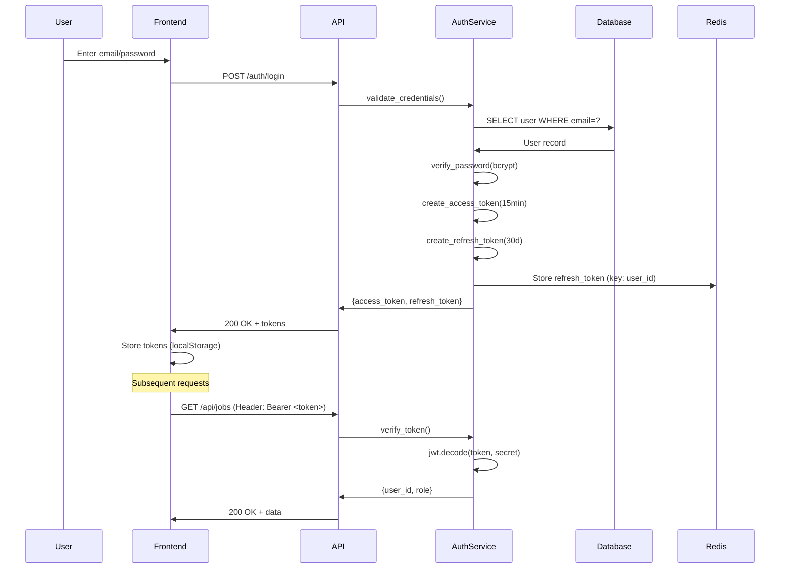

# Security Architecture: Logical Level
## RoleFerry Platform

**RM-ODP Viewpoints**: Computational, Engineering (Logical)  
**Audience**: Security Engineers, Backend Developers  
**Purpose**: Security controls, authentication flows, encryption mechanisms

---

## 1. Authentication Architecture

### 1.1 Authentication Flow (JWT-Based)



### 1.2 Token Structure

**Access Token (JWT)**:
```json
{
  "header": {
    "alg": "HS256",
    "typ": "JWT"
  },
  "payload": {
    "sub": "1234",  // user_id
    "role": "job_seeker",
    "exp": 1697200900,  // 15 minutes from now
    "iat": 1697200000
  },
  "signature": "..." 
}
```

**Refresh Token** (opaque string):
- Stored in Redis: `refresh_token:{user_id}:{random_uuid}`
- TTL: 30 days
- One-time use (rotated on refresh)

---

## 2. Authorization Model

### 2.1 Role-Based Access Control (RBAC)

| Role | Permissions | Applies To |
|------|-------------|------------|
| **job_seeker** | CRUD own applications, view public jobs | End users (B2C) |
| **recruiter** | CRUD own leads, bulk import/export | End users (B2B) |
| **admin** | Read all data, modify platform settings | Internal team |
| **support** | Read user data (for support tickets) | Customer success team |

### 2.2 Authorization Check (Middleware)

```python
# backend/app/middleware/authorization.py
from fastapi import Request, HTTPException

async def check_authorization(request: Request, required_role: str = None):
    user = request.state.user  # Set by auth middleware
    
    # Job seekers can only access their own applications
    if user['role'] == 'job_seeker':
        resource_user_id = request.path_params.get('user_id')
        if resource_user_id and resource_user_id != user['user_id']:
            raise HTTPException(status_code=403, detail="Access denied")
    
    # Role-specific checks
    if required_role and user['role'] != required_role:
        raise HTTPException(status_code=403, detail=f"Requires {required_role} role")
    
    return True

# Usage in routes
@router.get("/applications/{user_id}")
async def get_user_applications(
    user_id: int,
    authorized: bool = Depends(check_authorization)
):
    # User can only access if user_id matches their token
    pass
```

---

## 3. Data Protection

### 3.1 Encryption at Rest

**Database Encryption** (RDS):
```bash
# Enable when creating RDS instance
aws rds create-db-instance \
  --db-instance-identifier roleferry-prod \
  --storage-encrypted \
  --kms-key-id arn:aws:kms:us-east-1:123456789:key/xxx
```

**S3 Encryption**:
```python
# Upload resume with server-side encryption
s3_client.put_object(
    Bucket='roleferry-prod-resumes',
    Key=f'user-{user_id}/resume.pdf',
    Body=file_content,
    ServerSideEncryption='AES256'
)
```

**Application-Level Encryption** (PII fields):
```python
from cryptography.fernet import Fernet

# Encrypt sensitive fields before storing
def encrypt_pii(plaintext: str) -> str:
    key = settings.ENCRYPTION_KEY  # From Secrets Manager
    f = Fernet(key)
    return f.encrypt(plaintext.encode()).decode()

def decrypt_pii(ciphertext: str) -> str:
    key = settings.ENCRYPTION_KEY
    f = Fernet(key)
    return f.decrypt(ciphertext.encode()).decode()

# Usage
user.hashed_password = encrypt_pii(password)  # Already bcrypt-hashed
```

---

### 3.2 Encryption in Transit

**TLS Configuration** (ALB):
```json
{
  "Protocol": "HTTPS",
  "Port": 443,
  "SslPolicy": "ELBSecurityPolicy-TLS13-1-2-2021-06",
  "Certificates": [{
    "CertificateArn": "arn:aws:acm:us-east-1:123456789:certificate/xxx"
  }]
}
```

**API Enforcement**:
```python
# Redirect HTTP to HTTPS
from fastapi.middleware.httpsredirect import HTTPSRedirectMiddleware

app.add_middleware(HTTPSRedirectMiddleware)

# HSTS header (force HTTPS for 1 year)
@app.middleware("http")
async def add_security_headers(request, call_next):
    response = await call_next(request)
    response.headers["Strict-Transport-Security"] = "max-age=31536000; includeSubDomains"
    response.headers["X-Content-Type-Options"] = "nosniff"
    response.headers["X-Frame-Options"] = "DENY"
    response.headers["X-XSS-Protection"] = "1; mode=block"
    return response
```

---

## 4. Input Validation & Sanitization

### 4.1 Schema Validation (Pydantic)

```python
from pydantic import BaseModel, EmailStr, constr, validator

class SignupRequest(BaseModel):
    email: EmailStr  # Auto-validates email format
    password: constr(min_length=8, max_length=100)  # Length constraints
    full_name: constr(min_length=1, max_length=255)
    
    @validator('password')
    def password_strength(cls, v):
        # Require uppercase, lowercase, number, symbol
        if not any(c.isupper() for c in v):
            raise ValueError('Password must contain uppercase')
        if not any(c.islower() for c in v):
            raise ValueError('Password must contain lowercase')
        if not any(c.isdigit() for c in v):
            raise ValueError('Password must contain number')
        if not any(c in '!@#$%^&*' for c in v):
            raise ValueError('Password must contain special char')
        return v

# FastAPI automatically validates request
@router.post("/auth/signup")
async def signup(request: SignupRequest):
    # request.email, request.password already validated
    pass
```

---

### 4.2 SQL Injection Prevention

**Parameterized Queries** (SQLAlchemy):
```python
# ✅ SAFE: Parameterized query
user = db.query(User).filter(User.email == user_email).first()

# ❌ UNSAFE: Raw SQL (never do this)
# db.execute(f"SELECT * FROM users WHERE email = '{user_email}'")

# ✅ SAFE: Even if using raw SQL
db.execute("SELECT * FROM users WHERE email = :email", {"email": user_email})
```

---

### 4.3 XSS Prevention

**Output Encoding** (React):
```tsx
// ✅ SAFE: React auto-escapes
<div>{user.full_name}</div>

// ❌ UNSAFE: dangerouslySetInnerHTML (only use for sanitized HTML)
<div dangerouslySetInnerHTML={{__html: userInput}} />

// ✅ SAFE: Sanitize first
import DOMPurify from 'dompurify';
const clean = DOMPurify.sanitize(userInput);
<div dangerouslySetInnerHTML={{__html: clean}} />
```

---

## 5. Network Security

### 5.1 VPC Configuration

```
┌──────────────────────────────────────────────────┐
│               VPC (10.0.0.0/16)                  │
│                                                  │
│  ┌────────────────────────────────────────────┐ │
│  │   Public Subnets (10.0.1.0/24, 10.0.2.0)   │ │
│  │   - ALB (Load Balancer)                    │ │
│  │   - NAT Gateway                            │ │
│  └────────────────────────────────────────────┘ │
│                                                  │
│  ┌────────────────────────────────────────────┐ │
│  │  Private Subnets (10.0.10.0/24, 10.0.11.0) │ │
│  │   - ECS Tasks (API, Workers)               │ │
│  │   - RDS (PostgreSQL)                       │ │
│  │   - ElastiCache (Redis)                    │ │
│  └────────────────────────────────────────────┘ │
└──────────────────────────────────────────────────┘
```

---

### 5.2 Security Groups

**ALB Security Group**:
```bash
# Allow inbound HTTPS from internet
aws ec2 authorize-security-group-ingress \
  --group-id sg-alb \
  --protocol tcp \
  --port 443 \
  --cidr 0.0.0.0/0
```

**API Security Group**:
```bash
# Allow inbound from ALB only
aws ec2 authorize-security-group-ingress \
  --group-id sg-api \
  --protocol tcp \
  --port 8000 \
  --source-group sg-alb
```

**Database Security Group**:
```bash
# Allow inbound from API tasks only
aws ec2 authorize-security-group-ingress \
  --group-id sg-db \
  --protocol tcp \
  --port 5432 \
  --source-group sg-api
```

---

## 6. Secrets Management

### 6.1 AWS Secrets Manager Integration

```python
import boto3
import json
from functools import lru_cache

@lru_cache(maxsize=128)
def get_secret(secret_name: str) -> dict:
    """Retrieve secret from AWS Secrets Manager (cached)"""
    client = boto3.client('secretsmanager', region_name='us-east-1')
    
    try:
        response = client.get_secret_value(SecretId=secret_name)
        return json.loads(response['SecretString'])
    except Exception as e:
        logging.error(f"Failed to retrieve secret {secret_name}: {e}")
        raise

# Usage
DATABASE_URL = get_secret('roleferry/prod/database_url')['url']
JWT_SECRET = get_secret('roleferry/prod/jwt_secret')['key']
```

---

### 6.2 Secret Rotation

```python
# Lambda function for automatic rotation
def lambda_handler(event, context):
    secret_arn = event['SecretId']
    token = event['ClientRequestToken']
    step = event['Step']
    
    if step == "createSecret":
        # Generate new secret
        new_secret = generate_random_key()
        secrets_manager.put_secret_value(
            SecretId=secret_arn,
            ClientRequestToken=token,
            SecretString=new_secret,
            VersionStages=['AWSPENDING']
        )
    
    elif step == "setSecret":
        # Update application to use new secret (test it)
        pass
    
    elif step == "testSecret":
        # Verify new secret works
        pass
    
    elif step == "finishSecret":
        # Mark new secret as current
        secrets_manager.update_secret_version_stage(
            SecretId=secret_arn,
            VersionStage='AWSCURRENT',
            MoveToVersionId=token
        )
```

---

## 7. Rate Limiting & DDoS Protection

### 7.1 Application-Level Rate Limiting

```python
from fastapi import Request, HTTPException
from redis import Redis
import time

redis_client = Redis(host='localhost', decode_responses=True)

async def rate_limit(request: Request, limit: int = 60, window: int = 60):
    """Rate limit: {limit} requests per {window} seconds"""
    user_id = request.state.user['user_id']
    key = f"ratelimit:{user_id}:{int(time.time() / window)}"
    
    current = redis_client.incr(key)
    if current == 1:
        redis_client.expire(key, window)
    
    if current > limit:
        raise HTTPException(
            status_code=429,
            detail="Rate limit exceeded",
            headers={"Retry-After": str(window)}
        )
    
    return True

# Apply to routes
@router.get("/jobs")
async def get_jobs(request: Request, limited: bool = Depends(rate_limit)):
    pass
```

---

### 7.2 WAF Rules (AWS WAF)

```json
{
  "Name": "RoleFerryWAFRules",
  "Rules": [
    {
      "Name": "RateLimitRule",
      "Priority": 1,
      "Statement": {
        "RateBasedStatement": {
          "Limit": 2000,
          "AggregateKeyType": "IP"
        }
      },
      "Action": {"Block": {}}
    },
    {
      "Name": "SQLiProtection",
      "Priority": 2,
      "Statement": {
        "ManagedRuleGroupStatement": {
          "VendorName": "AWS",
          "Name": "AWSManagedRulesSQLiRuleSet"
        }
      },
      "OverrideAction": {"None": {}}
    },
    {
      "Name": "GeoBlocking",
      "Priority": 3,
      "Statement": {
        "GeoMatchStatement": {
          "CountryCodes": ["CN", "RU", "KP"]
        }
      },
      "Action": {"Block": {}}
    }
  ]
}
```

---

## 8. Audit Logging

### 8.1 Audit Log Schema

```sql
CREATE TABLE audit_logs (
    id SERIAL PRIMARY KEY,
    user_id INTEGER,
    action VARCHAR(100) NOT NULL,  -- 'user.login', 'application.create', 'pii.access'
    resource_type VARCHAR(50),  -- 'application', 'contact', 'user'
    resource_id INTEGER,
    ip_address INET,
    user_agent TEXT,
    request_method VARCHAR(10),
    request_path VARCHAR(500),
    response_status INTEGER,
    created_at TIMESTAMP WITH TIME ZONE DEFAULT NOW()
);

CREATE INDEX idx_audit_user ON audit_logs(user_id, created_at DESC);
CREATE INDEX idx_audit_action ON audit_logs(action, created_at DESC);
CREATE INDEX idx_audit_resource ON audit_logs(resource_type, resource_id);
```

### 8.2 Audit Middleware

```python
@app.middleware("http")
async def audit_logger(request: Request, call_next):
    start_time = time.time()
    
    # Process request
    response = await call_next(request)
    
    # Log sensitive operations
    if request.method in ['POST', 'PUT', 'DELETE'] or '/admin/' in request.url.path:
        duration = (time.time() - start_time) * 1000
        
        await log_audit_event({
            "user_id": getattr(request.state, 'user', {}).get('user_id'),
            "action": f"{request.method} {request.url.path}",
            "ip_address": request.client.host,
            "user_agent": request.headers.get('user-agent'),
            "response_status": response.status_code,
            "duration_ms": duration
        })
    
    return response
```

---

## 9. Secure Communication

### 9.1 API Security Headers

```python
security_headers = {
    "Strict-Transport-Security": "max-age=31536000; includeSubDomains; preload",
    "X-Content-Type-Options": "nosniff",
    "X-Frame-Options": "DENY",
    "X-XSS-Protection": "1; mode=block",
    "Content-Security-Policy": "default-src 'self'; script-src 'self' 'unsafe-inline'; style-src 'self' 'unsafe-inline'",
    "Referrer-Policy": "strict-origin-when-cross-origin",
    "Permissions-Policy": "geolocation=(), microphone=(), camera=()"
}
```

---

### 9.2 CORS Configuration

```python
from fastapi.middleware.cors import CORSMiddleware

app.add_middleware(
    CORSMiddleware,
    allow_origins=[
        "https://roleferry.com",
        "https://app.roleferry.com",
        "https://staging.roleferry.com"  # Only in staging env
    ],
    allow_credentials=True,
    allow_methods=["GET", "POST", "PUT", "DELETE"],
    allow_headers=["Authorization", "Content-Type"],
    expose_headers=["X-Total-Count"],  # For pagination
    max_age=3600  # Cache preflight for 1 hour
)
```

---

## 10. Security Testing

### 10.1 Automated Security Scans

**SAST (Static Analysis)**:
```yaml
# .github/workflows/security.yml
- name: Run Bandit (Python)
  run: bandit -r backend/app -f json -o bandit-report.json

- name: Run ESLint Security Plugin
  run: npm run lint:security
```

**Dependency Scanning** (Snyk):
```yaml
- name: Snyk vulnerability scan
  run: snyk test --severity-threshold=high
```

---

### 10.2 Penetration Testing Checklist

**Pre-Launch Security Audit**:
- [ ] SQL Injection testing (all input fields)
- [ ] XSS testing (user-generated content)
- [ ] CSRF protection verified
- [ ] Authentication bypass attempts
- [ ] Authorization escalation attempts
- [ ] Session management vulnerabilities
- [ ] Sensitive data exposure
- [ ] API rate limiting effectiveness
- [ ] Infrastructure misconfigurations

**Tool**: OWASP ZAP, Burp Suite, or external firm (Phase 2)

---

## 11. Incident Detection & Response

### 11.1 Security Monitoring Alerts

**Suspicious Activity Detection**:
```python
# Detect multiple failed logins
SELECT user_id, COUNT(*) as failed_attempts
FROM audit_logs
WHERE action = 'auth.login_failed'
  AND created_at > NOW() - INTERVAL '10 minutes'
GROUP BY user_id
HAVING COUNT(*) >= 5;

# Alert via Datadog
if failed_attempts >= 5:
    datadog.event(
        title="Potential credential stuffing attack",
        text=f"User {user_id} has {failed_attempts} failed logins",
        alert_type="warning"
    )
```

**Abnormal API Usage**:
```python
# Detect API abuse (>1K requests/hour from single user)
if user_request_count_1h > 1000:
    # Temporarily rate limit user
    redis.setex(f"ratelimit:user:{user_id}:blocked", 3600, "1")
    # Alert ops
    send_alert("Abnormal API usage", user_id)
```

---

## 12. Acceptance Criteria

- [ ] Authentication flow implemented (JWT + refresh tokens)
- [ ] Authorization middleware enforces RBAC
- [ ] Encryption enabled (database, S3, in-transit)
- [ ] Input validation on all API endpoints (Pydantic)
- [ ] Security headers configured (HSTS, CSP, etc.)
- [ ] Rate limiting implemented (Redis-based)
- [ ] Audit logging captures sensitive operations
- [ ] WAF rules deployed (SQL injection, rate limiting)
- [ ] Security testing automated (SAST, dependency scans)
- [ ] Incident detection alerts configured

---

**Document Owner**: Security Engineer, Backend Lead  
**Version**: 1.0  
**Date**: October 2025  
**Next Review**: Quarterly (after penetration tests)

