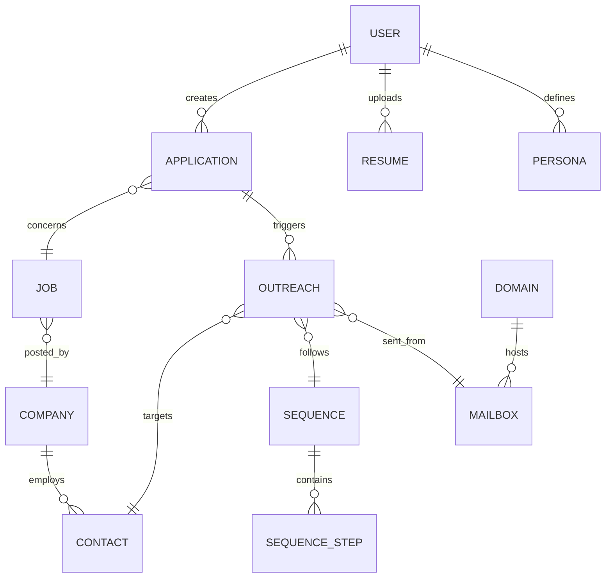

# System Architecture: Conceptual Level
## RoleFerry Platform

**RM-ODP Viewpoints**: Enterprise, Information, Computational (Conceptual)  
**Audience**: Stakeholders, Business Analysts, Product Managers  
**Purpose**: Business concepts and high-level system understanding

---

## 1. Enterprise Viewpoint

### 1.1 Business Mission
RoleFerry automates job application outreach by intelligently connecting candidates with decision-makers through personalized, deliverable email sequences—eliminating the "apply and pray" model.

### 1.2 Stakeholder Landscape

#### Primary Stakeholders
| Stakeholder | Goals | Concerns |
|------------|-------|----------|
| **Job Seekers** | Get interviews faster, reduce manual work | Email deliverability, contact accuracy, cost |
| **Recruiters** | Scale outbound sourcing, improve reply rates | Compliance, integration with ATS, team collaboration |
| **Platform Admins** | System reliability, cost efficiency | Deliverability reputation, API costs, scale |
| **Investors** | Growth, retention, unit economics | Product-market fit, competitive moat, TAM capture |

#### Secondary Stakeholders
- **Email Service Providers** (SendGrid, Mailgun): Infrastructure dependencies
- **Data Providers** (Apollo, Clay): Contact enrichment partnerships
- **Regulators** (FTC, EU DPA): CAN-SPAM, GDPR compliance
- **Career Coaches**: White-label partners

### 1.3 Business Scenarios

#### Scenario 1: 10-Tab Workflow - Job Seeker Journey
**Actor**: Sarah, 7-year Product Manager  
**Context**: Searching for senior PM role, applying to 30+ companies/month  
**Goals**: Complete intelligent workflow from preferences to campaign launch

**10-Tab Flow**:
1. **Job Preferences**: Sarah sets industries (SaaS, FinTech), roles (Senior PM), salary ($120-150k), location (Remote)
2. **Resume**: Uploads resume, AI extracts B2B SaaS experience, metrics, accomplishments
3. **Job Descriptions**: Imports JD from LinkedIn, AI identifies pain points (scaling, user acquisition)
4. **Pain Point Match**: System scores 87% alignment - Sarah's growth experience matches their scaling challenges
5. **Find Contact**: Discovers VP Product (hiring manager) with 95% confidence, email verified as valid
6. **Context Research**: Auto-pulls company summary, recent funding news, contact bio
7. **Offer Creation**: AI generates personalized pitch with Manager tone (proof of competence)
8. **Compose**: Email generated with variables, jargon detected and explained
9. **Campaign**: 3-email sequence auto-created with optimal timing
10. **Deliverability/Launch**: Pre-flight checks pass, campaign launched successfully

**Value**: Complete automation from preferences to outreach in 10 structured steps

---

#### Scenario 2: 10-Tab Workflow - Recruiter Journey
**Actor**: Marcus, Agency Recruiter  
**Context**: Placing senior engineers, needs to scale candidate outreach  
**Goals**: Complete intelligent workflow from ICP to candidate campaign launch

**10-Tab Flow (Recruiter Mode)**:
1. **Ideal Client Profile (ICP)**: Marcus defines target companies (Series B SaaS), roles (Senior Engineers), budget ($150-200k)
2. **Candidate Profile**: Uploads candidate resume, AI extracts technical experience, achievements, metrics
3. **Job Descriptions**: Imports client JD, AI identifies technical challenges (microservices, scaling)
4. **Pain Point Match**: System scores 92% alignment - candidate's AWS experience matches their cloud challenges
5. **Find Contact**: Discovers Engineering Manager with 88% confidence, email verified as valid
6. **Context Research**: Auto-pulls company tech stack, recent engineering hires, manager background
7. **Offer Creation**: AI generates candidate pitch with Exec tone (ROI/strategy focus)
8. **Compose**: Email generated with candidate variables, technical jargon explained
9. **Campaign**: 3-email sequence auto-created for candidate placement
10. **Deliverability/Launch**: Pre-flight checks pass, candidate campaign launched

**Value**: Complete automation from ICP to candidate outreach in 10 structured steps

#### Scenario 3: Traditional Job Seeker Applies to Target Company
**Actor**: Sarah, 7-year Product Manager  
**Context**: Searching for senior PM role, applying to 30+ companies/month  
**Goals**: Reach hiring manager directly, stand out from ATS pile

**Flow**:
1. Sarah browses matched jobs (75%+ fit)
2. Clicks "Apply" on Series B SaaS company
3. RoleFerry finds VP Product (hiring manager) + HR contact
4. AI drafts email referencing Sarah's B2B SaaS experience + metrics
5. Email sent from RoleFerry domain (preserves Sarah's Gmail reputation)
6. VP Product replies in 36 hours → Sarah invited to screen
7. Sarah logs interview in Tracker, moves to "Interviewing" stage

**Value**: 3x faster response vs. blind application; no manual LinkedIn stalking  
**Context**: Filling 5 engineering roles, needs passive candidates  
**Goals**: Contact 200 qualified engineers, get 20 replies, schedule 10 calls

**Flow**:
1. Marcus imports CSV of 200 LinkedIn profiles (scraped via third-party tool)
2. RoleFerry enriches: company domain → work email → verification
3. Marcus selects "Senior Engineer" persona (titles, seniority, location filters)
4. Applies 3-step sequence: intro → value prop → breakup email
5. Sequence launches, emails spread across 4 domains (50/day per domain)
6. 22 replies in 2 weeks (11% reply rate)
7. Marcus schedules calls, syncs to Greenhouse ATS

**Value**: 5x cheaper than LinkedIn Recruiter; email beats InMail response rates

---

#### Scenario 3: Deliverability Crisis Averted
**Actor**: Platform Operations Team  
**Context**: One sending domain experiences elevated bounce rate  
**Goals**: Prevent blacklisting, maintain 95%+ inbox placement

**Flow**:
1. Health monitoring detects Domain A: 8% bounce rate (threshold: 5%)
2. System auto-pauses new sends from Domain A
3. Alert sent to ops team: "Domain A health degraded to 62/100"
4. Ops reviews: bulk of bounces from stale enrichment data (90-day-old emails)
5. Ops enables aggressive verification (re-verify emails <95% confidence)
6. Domain A enters 7-day warmup re-ramp (20 emails/day increasing 10%/day)
7. Health recovers to 85/100; production traffic resumed

**Value**: $50K sending infrastructure protected; zero user-facing impact

---

### 1.4 Value Propositions

#### For Job Seekers
1. **Speed**: Apply → Contact found → Email sent in <60 seconds
2. **Effectiveness**: 3x higher reply rate vs. blind applications
3. **Safety**: RoleFerry domains absorb deliverability risk, not personal email
4. **Intelligence**: AI match scoring + draft generation (10x time savings)

#### For Recruiters
1. **Scale**: Contact 1,000+ candidates/month with 1 recruiter
2. **Cost**: $1,800/year vs. $8,000 for LinkedIn Recruiter
3. **Multichannel**: Email + LinkedIn (vs. InMail-only)
4. **Compliance**: CAN-SPAM/GDPR built-in (vs. DIY risk)

### 1.5 Business Policies

#### Outreach Constraints
- **Throttling**: Max 50 emails/day per mailbox (prevent spam flags)
- **Suppression**: Honor opt-outs within 1 hour (CAN-SPAM)
- **Verification**: Min 80% email confidence before sending
- **Stop-on-Reply**: Sequences auto-cancel on recipient response

#### Data Governance
- **PAI Sourcing**: Contacts from publicly available sources (Apollo, LinkedIn, company sites)
- **Retention**: Contact data deleted 90 days after last interaction (GDPR "right to be forgotten")
- **Transparency**: Source attribution shown to users ("Found via Apollo")

#### Economic Model
- **Free Tier**: 10 applications/month (drives acquisition)
- **Paid Conversion**: 10% free → Pro within 30 days
- **Usage Caps**: Enrichment credits & sending limits (prevent abuse)

---

## 2. Information Viewpoint

### 2.1 Business Entities



### 2.2 Core Information Objects

#### User
Represents job seeker or recruiter account.
- **Identity**: Email, name, mode (seeker/recruiter)
- **Profile**: Resume data, IJP preferences, subscription tier
- **Lifecycle**: Active, paused (not searching), churned

#### Application (Job Seeker) / Lead (Recruiter)
Central pipeline record.
- **Linkages**: User → Job → Company → Contacts
- **Status**: Saved, Applied, Interviewing, Offer, Rejected (or Recruiter equivalents)
- **Timeline**: Created, last action, status changes
- **Metadata**: Notes, interview dates, reply state

#### Job
Represents open position.
- **Source**: Scraped from job boards, ATS, user-submitted
- **Details**: Title, JD text, comp range, location, visa requirements
- **Enrichment**: Company domain, size, industry, Glassdoor rating

#### Company
Organization entity (employer or target company).
- **Identity**: Name, domain (unique key)
- **Enrichment**: Size, industry, funding, tech stack, social profiles
- **Contacts**: Aggregated from enrichment (not stored long-term without consent)

#### Contact
Individual person at company.
- **Identity**: Name, title, work email, LinkedIn URL
- **Verification**: Confidence score, verification date, source
- **Suppression**: Opt-out status, bounce history

#### Sequence
Multi-step email campaign template.
- **Steps**: Subject, body, delay (hours/days), conditions (stop-on-reply)
- **Variables**: Placeholders ({{first_name}}, {{company}}, {{role}})
- **Ownership**: User-created or platform templates

#### Outreach
Individual email send event.
- **Linkages**: Application → Contact → Sequence Step
- **Status**: Queued, sent, delivered, bounced, opened, clicked, replied
- **Telemetry**: Timestamps, link clicks, LivePage views

#### Domain & Mailbox
Sending infrastructure.
- **Domain**: Owned by RoleFerry (e.g., rf-send-01.com)
- **Mailbox**: Individual sender (e.g., auto1@rf-send-01.com)
- **Health**: Score (0-100), bounce rate, spam reports, warmup status

### 2.3 Information Flows

#### Flow 1: Apply → Enrich → Send
1. **Input**: User clicks Apply on Job
2. **Process**: 
   - Create Application record
   - Trigger enrichment job (Company → Contacts)
   - Generate email draft (LLM)
   - Queue sequence
3. **Output**: Emails scheduled, Tracker updated

#### Flow 2: Reply → Status Update
1. **Input**: Inbound email webhook (recipient replied)
2. **Process**:
   - Match reply to Outreach record
   - Stop remaining sequence steps
   - Parse sentiment (LLM)
   - Update Application status
3. **Output**: Notification to user, Tracker reflects reply

#### Flow 3: Health Degradation → Throttle
1. **Input**: Daily health check (bounce rate > 5%)
2. **Process**:
   - Calculate health score per domain
   - If score < 70, pause new sends
   - Alert ops team
3. **Output**: Traffic shifted to healthy domains

---

## 3. Computational Viewpoint (Conceptual)

### 3.1 Functional Decomposition

```
RoleFerry Platform
├── Presentation Layer
│   ├── Web Application (Next.js)
│   └── API Gateway (FastAPI)
├── Application Services
│   ├── Job Matching Service
│   ├── Enrichment Orchestrator
│   ├── Outreach Sequencer
│   └── Analytics Engine
├── Domain Services
│   ├── User Management
│   ├── Application/Lead Tracker
│   ├── Contact Discovery
│   └── Deliverability Manager
├── Integration Layer
│   ├── Apollo Client
│   ├── Clay Client
│   ├── Email Service (SendGrid/Mailgun)
│   └── LLM Providers (Anthropic, OpenAI)
└── Data Layer
    ├── Primary Database (PostgreSQL)
    ├── Cache (Redis)
    └── Object Storage (S3)
```

### 3.2 Component Responsibilities

#### Job Matching Service
- **Purpose**: Score jobs against user IJP
- **Inputs**: User profile, job postings
- **Outputs**: Match score (0-100), breakdown (experience/skills/industry %)
- **Intelligence**: ML model trained on user feedback (thumbs up/down)

#### Enrichment Orchestrator
- **Purpose**: Coordinate multi-provider contact discovery
- **Inputs**: Company name/domain, persona filters
- **Outputs**: 1-3 verified contacts (name, title, email)
- **Logic**: Waterfall (Apollo → Clay → fallback), verification step, deduplication

#### Outreach Sequencer
- **Purpose**: Schedule and send multi-step email campaigns
- **Inputs**: Contact list, sequence template, variables
- **Outputs**: Queued emails, delivery status tracking
- **Rules**: Throttling, stop-on-reply, domain rotation

#### Deliverability Manager
- **Purpose**: Monitor and maintain sending infrastructure health
- **Inputs**: Bounce/spam reports, send volume
- **Outputs**: Health scores, throttling decisions, alerts
- **Actions**: Auto-pause degraded domains, warmup protocols

### 3.3 User Interaction Patterns

#### Pattern 1: Synchronous Actions (Web Request)
- **Examples**: Load Jobs List, view Tracker, edit preferences
- **Flow**: Browser → API Gateway → Service → Database → Response
- **Latency**: <500ms target

#### Pattern 2: Asynchronous Jobs (Background Processing)
- **Examples**: Enrichment, email sending, match re-scoring
- **Flow**: API enqueues job → Worker picks up → Processes → Updates DB → Notifies user
- **Latency**: <5 minutes for enrichment, <1 hour for sends

#### Pattern 3: Event-Driven Updates (Webhooks)
- **Examples**: Email reply, link click, LivePage view
- **Flow**: External service → Webhook → Event processor → Update DB → Push notification
- **Latency**: <1 minute

---

## 4. Key Architectural Principles

### 4.1 Separation of Concerns
- **Presentation** (UI/UX) decoupled from **Business Logic** (services)
- **Domain Services** own business rules; **Integration Layer** handles external APIs
- **Data Layer** abstracted behind repository pattern (swap DB without changing services)

### 4.2 Asynchronous by Default
- Long-running tasks (enrichment, sending) processed in background queues
- User sees instant feedback ("Enrichment started..."), not loading spinners
- Enables horizontal scaling (add workers without touching API servers)

### 4.3 Fail-Safe Mechanisms
- **Enrichment**: Waterfall to fallback providers if primary fails
- **Sending**: Queue retry logic (3 attempts with exponential backoff)
- **Health**: Auto-pause domains before blacklisting occurs

### 4.4 Data Minimization
- Contacts not stored long-term (90-day TTL)
- PII encrypted at rest and in transit
- Logs sanitized (no email content in application logs)

### 4.5 Observable Operations
- All services emit metrics (latency, error rate, throughput)
- Centralized logging (ELK stack)
- Real-time alerting (PagerDuty) for critical failures

---

## 5. Non-Functional Characteristics

### 5.1 Scalability
- **Target**: 100K users, 1M emails/day
- **Approach**: Horizontal scaling (add servers/workers), partitioned queues

### 5.2 Availability
- **Target**: 99.5% uptime (SLA for paid users)
- **Approach**: Multi-AZ deployment, automated failover, health checks

### 5.3 Performance
- **Latency**: API P95 <500ms, enrichment <30s, email queue <5min
- **Throughput**: 10K concurrent users, 500 enrichments/min

### 5.4 Security
- **Authentication**: OAuth2 (Google, Microsoft) + email/password
- **Authorization**: RBAC (job seeker, recruiter, admin roles)
- **Data Protection**: Encryption at rest (AES-256), in transit (TLS 1.3)

### 5.5 Compliance
- **CAN-SPAM**: Opt-out within 1 hour, physical address in footer
- **GDPR**: Right to access, delete, export (self-service in Settings)
- **SOC 2 Type II**: Target certification by Year 2

---

## 6. Risks & Constraints

### 6.1 Business Risks
| Risk | Impact | Mitigation |
|------|--------|------------|
| Deliverability failure | Existential (core value prop fails) | Multi-domain pool, health monitoring, gradual warmup |
| Contact data accuracy | Churn (low reply rates) | Multi-provider waterfall, verification, user feedback loop |
| Regulatory action | Legal liability, fines | Legal review, conservative policies, audit trail |

### 6.2 Technical Constraints
- **API Rate Limits**: Apollo (1,000 req/day), Clay (10K credits/mo) → Requires caching, batching
- **Email Sending Caps**: 50/day per mailbox (ISP limits) → Need 100+ mailboxes for scale
- **LLM Costs**: $0.01/draft (Anthropic Sonnet) → Optimize prompts, cache common patterns

### 6.3 Organizational Constraints
- **Team Size**: 4 engineers (2 full-stack, 1 backend, 1 ML) → Prioritize ruthlessly, use managed services
- **Budget**: $50K/mo infrastructure → Optimize API usage, negotiate volume discounts

---

## 7. Success Criteria (Architecture)

### 7.1 Functional
- [ ] Job list loads <2s with 1,000 jobs
- [ ] Enrichment finds 80%+ verified contacts
- [ ] Sequences send within 5 minutes of schedule
- [ ] Reply detection latency <1 minute

### 7.2 Operational
- [ ] System handles 10K concurrent users without degradation
- [ ] 99.5% API uptime (measured monthly)
- [ ] Zero critical security vulnerabilities (penetration test)
- [ ] <5% error rate on enrichment jobs

### 7.3 Business
- [ ] 15%+ email reply rate (platform average)
- [ ] 95%+ inbox placement (deliverability)
- [ ] <$10 CAC (infrastructure cost per new user)

---

## 8. Future Considerations

### Phase 2 (Months 7-12)
- Mobile app (React Native) for Tracker + reply management
- LinkedIn integration (auto-connection requests)
- Advanced ML (predictive reply scoring, send-time optimization)

### Phase 3 (Year 2+)
- White-label platform (career coaches rebrand RoleFerry)
- API for third-party integrations (ATS vendors, recruiting platforms)
- International expansion (EU, APAC data residency)

---

**Document Owner**: Chief Architect  
**Stakeholder Sign-Off**: CEO, CTO, Head of Product  
**Version**: 1.0  
**Date**: October 2025  
**Next Review**: Q1 2026 (post-MVP launch)

