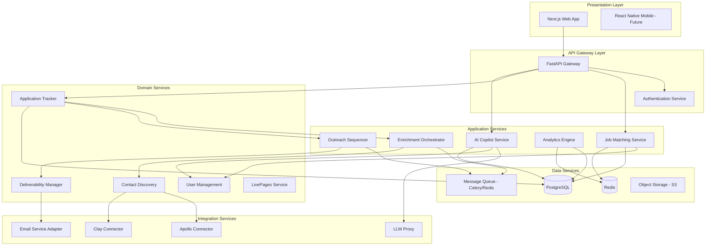
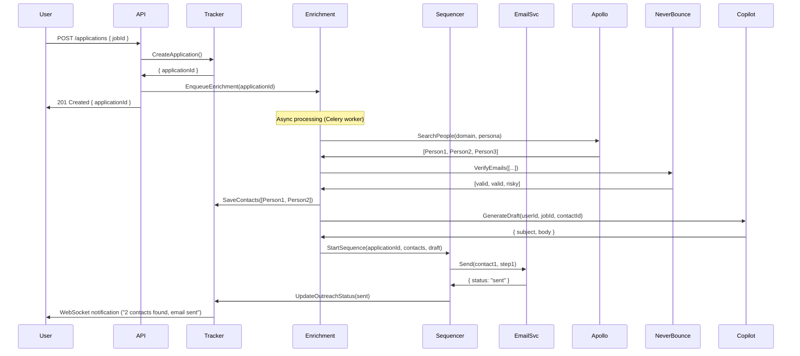
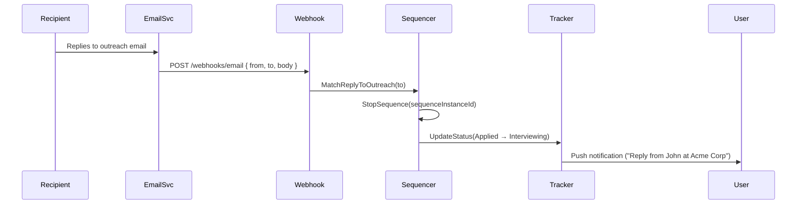

# System Architecture: Logical Level
## RoleFerry Platform

**RM-ODP Viewpoints**: Computational, Engineering (Logical)  
**Audience**: Software Architects, Senior Engineers, Technical Leads  
**Purpose**: Service interfaces, workflows, deployment-agnostic technical design

---

## 1. Computational Viewpoint (Logical)

### 1.1 Service Decomposition

The RoleFerry platform follows a **service-oriented architecture** with clear boundaries between domains. Services communicate via REST APIs (synchronous) and message queues (asynchronous).



### 1.2 Service Specifications

#### 1.2.1 API Gateway Service
**Responsibility**: Entry point for all client requests; routing, authentication, rate limiting.

**Interfaces**:
```
POST   /api/auth/login
POST   /api/auth/signup
GET    /api/auth/me

GET    /api/jobs?filters={...}
GET    /api/jobs/{id}
POST   /api/applications
GET    /api/applications?mode=jobseeker|recruiter

POST   /api/enrichment/start
GET    /api/enrichment/status/{job_id}

POST   /api/sequences/start
GET    /api/sequences/{id}/steps
PUT    /api/sequences/{id}/pause

GET    /api/analytics/dashboard
GET    /api/analytics/reply-rate

POST   /api/copilot/ask
GET    /api/copilot/context
```

**Quality Attributes**:
- **Latency**: P95 < 500ms (simple GET), < 2s (complex aggregations)
- **Throughput**: 1,000 req/sec sustained
- **Availability**: 99.9% (load-balanced, multi-instance)

---

#### 1.2.2 Job Matching Service
**Responsibility**: Score jobs against user Intent & Job Preferences (IJP); maintain match index.

**Interfaces**:
```
GET    /internal/match/score
Input:  { userId, jobId }
Output: { score: 0-100, breakdown: { exp: %, skills: %, industry: % } }

POST   /internal/match/rescore-user
Input:  { userId }
Output: { jobsRescored: count, avgScore: number }
```

**Logic**:
1. Retrieve user IJP (role, skills, location, industry, company size, salary)
2. Retrieve job data (title, JD keywords, location, company metadata)
3. Calculate sub-scores:
   - **Experience**: Match role level (IC → IC = 100%, IC → Director = 50%)
   - **Skills**: Jaccard similarity (user skills ∩ job skills / union)
   - **Industry**: Binary (match = 100%, else 0%)
4. Weighted average: 40% experience, 40% skills, 20% industry
5. Cache result (TTL: 24 hours)

**Dependencies**:
- User Management (get IJP)
- Primary DB (jobs table)
- Redis Cache (match scores)

**Error Handling**:
- User without IJP → Return default score (50%)
- Job missing data → Graceful degradation (skip missing fields)

---

#### 1.2.3 Enrichment Orchestrator
**Responsibility**: Coordinate multi-provider contact discovery waterfall.

**Interfaces**:
```
POST   /internal/enrich/company
Input:  { companyName, domain?, persona? }
Output: { jobId: uuid, status: "queued" }

GET    /internal/enrich/status/{jobId}
Output: { status: "processing" | "completed" | "failed", contacts: [...], errors: [...] }
```

**Workflow** (Asynchronous):
```
1. Enqueue job → Celery worker picks up
2. Step 1: Company Domain Lookup
   - Try: Clearbit Domain API → { domain, logo, size, industry }
   - Fallback: Google Search → parse company website
3. Step 2: Find People at Company
   - Apollo People Search API: domain + persona filters → 10 profiles
   - Clay "Find People at Company" → 5 profiles
   - Merge, deduplicate by email/LinkedIn URL
4. Step 3: Email Discovery
   - For each profile WITHOUT email:
     - Apollo Email Finder
     - Hunter.io
     - Snov.io
   - Take first valid result
5. Step 4: Email Verification
   - NeverBounce Bulk Verify → { valid, risky, invalid, unknown }
   - Filter: Keep "valid" + "risky" (if confidence > 70%)
6. Step 5: Rank & Return Top 3
   - Scoring: Title match (VP > Director > Manager) + verification confidence
   - Return: [ { name, title, email, linkedin, source, confidence } ]
```

**Dependencies**:
- Apollo Client
- Clay Client
- Hunter, Snov.io (email finders)
- NeverBounce (verification)
- Message Queue (Celery)

**Timeouts & Retries**:
- Per-provider timeout: 10 seconds
- Job timeout: 60 seconds total
- Retry: 3 attempts with exponential backoff (2s, 4s, 8s)

**Cost Control**:
- Cache enrichment results (company domain → 30 days, people → 7 days)
- Check cache before hitting paid APIs
- User credit limits enforced

---

#### 1.2.4 Outreach Sequencer
**Responsibility**: Schedule, send, and track multi-step email campaigns.

**Interfaces**:
```
POST   /internal/sequences/start
Input:  { applicationId, contactIds: [], sequenceTemplateId, variables: {...} }
Output: { sequenceInstanceId: uuid }

POST   /internal/sequences/stop
Input:  { sequenceInstanceId, reason: "reply" | "manual" | "bounce" }
Output: { stoppedSteps: count }

GET    /internal/sequences/{instanceId}/status
Output: { steps: [ { stepNo, status, sentAt, deliveredAt, repliedAt } ] }
```

**Workflow**:
```
1. Create SequenceInstance record (links Application → Contacts → Template)
2. For each contact, create OutreachStep records:
   - Step 1: Send immediately (or next available slot)
   - Step 2: Send after delay (e.g., +2 days)
   - Step 3: Send after delay (e.g., +3 days after Step 2)
3. Enqueue Step 1 sends → Celery workers process
4. Workers:
   - Select mailbox (round-robin from healthy domains)
   - Substitute variables: {{first_name}} → contact.firstName
   - Rewrite links via Custom Tracking Domain
   - Send via EmailService (SendGrid/Mailgun)
   - Log OutreachEvent (sent, delivered, bounced, opened, clicked)
5. On delivery:
   - Schedule next step (enqueue with delay)
6. On reply webhook:
   - Cancel remaining steps
   - Mark sequence as "stopped"
   - Update Application status (Applied → Interviewing)
```

**Stop-on-Reply Logic**:
- Webhook from email service → parse sender
- Match sender to Contact → find active SequenceInstance
- Cancel future OutreachStep records (status: queued → canceled)
- Latency: <1 minute from reply received to stop

**Throttling**:
- Per mailbox: 50 emails/day
- If queue exceeds cap, spill to next day
- Domain rotation: Distribute sends across pool (e.g., 5 domains = 250 emails/day total)

**Dependencies**:
- Deliverability Manager (get healthy mailboxes)
- Email Service Adapter
- Custom Tracking Domain service (link rewriting)
- Message Queue

---

#### 1.2.5 Deliverability Manager
**Responsibility**: Monitor sending infrastructure health; enforce throttling; manage warmup.

**Interfaces**:
```
GET    /internal/deliverability/mailboxes
Output: [ { mailbox, domain, healthScore, dailyCap, sentToday, status: "active" | "paused" | "warmup" } ]

POST   /internal/deliverability/select-mailbox
Input:  { count: 1, excludeDomains: [] }
Output: { mailbox, domain }

POST   /internal/deliverability/report-event
Input:  { mailbox, event: "bounce" | "spam" | "delivered", timestamp }
Output: { acknowledged: true }

POST   /internal/deliverability/warmup/enable
Input:  { domain }
Output: { warmupSchedule: [...] }
```

**Health Scoring Algorithm**:
```python
def calculate_health(mailbox, last_7_days):
    sent = mailbox.sent_count
    bounces = mailbox.bounce_count
    spam_reports = mailbox.spam_count
    
    bounce_rate = bounces / sent if sent > 0 else 0
    spam_rate = spam_reports / sent if sent > 0 else 0
    
    # Penalties
    bounce_penalty = min(bounce_rate * 500, 50)  # Max -50 for 10%+ bounce
    spam_penalty = spam_reports * 20             # -20 per spam report
    
    # Base score
    health = 100 - bounce_penalty - spam_penalty
    
    # Warmup bonus
    if mailbox.warmup_days >= 30:
        health += 10
    
    return max(0, min(100, health))
```

**Health Thresholds**:
- **90-100**: Excellent (no restrictions)
- **70-89**: Good (normal operation)
- **50-69**: Fair (throttle to 30/day)
- **<50**: Poor (pause, investigate)

**Warmup Protocol**:
```
Day 1-3:    5 emails/day   (to seed accounts, auto-replies enabled)
Day 4-7:    10 emails/day
Day 8-14:   20 emails/day
Day 15-30:  Increase 10%/day until 50/day
Day 30+:    Production (50/day)
```

**Seed Accounts**: Internal RoleFerry emails that auto-reply to warmup sends, simulating engagement.

**Dependencies**:
- Primary DB (mailboxes, health_logs)
- Email Service webhooks (bounce/spam events)

---

#### 1.2.6 AI Copilot Service
**Responsibility**: Context-aware AI assistance (match explanations, draft generation, Q&A).

**Interfaces**:
```
POST   /internal/copilot/ask
Input:  { userId, context: { jobId?, applicationId? }, question: string }
Output: { answer: string, citations: [...], tokens: count }

POST   /internal/copilot/generate-draft
Input:  { userId, jobId, contactId, tone: "casual" | "formal" }
Output: { subject: string, body: string }
```

**Context Assembly**:
1. Retrieve user resume extract (roles, tenure, metrics, accomplishments)
2. Retrieve job details (title, JD, company)
3. Retrieve contact (name, title)
4. Assemble prompt:
```
You are a career coach helping a job seeker.

User Background:
- Current role: {user.currentRole}
- Experience: {user.yearsExp} years
- Key metrics: {user.keyMetrics}

Job Details:
- Title: {job.title}
- Company: {job.company}
- JD excerpt: {job.jd[:500]}

Contact:
- Name: {contact.name}
- Title: {contact.title}

Question: {question}

Provide a concise, actionable answer.
```

**LLM Provider Selection**:
- **Primary**: Anthropic Claude Sonnet (long context, high quality)
- **Fallback**: OpenAI GPT-4 Turbo
- **Cost**: $0.003/1K tokens (input), $0.015/1K tokens (output)

**Caching**:
- Frequent questions cached (e.g., "Why is this a fit?") → 24-hour TTL
- Drafts NOT cached (always unique)

**Dependencies**:
- LLM Proxy (rate limiting, failover)
- User Management (resume extract)
- Primary DB (jobs, contacts)

---

### 1.3 Integration Layer Specifications

#### 1.3.1 Apollo Connector
**Purpose**: Query Apollo.io API for company/contact data.

**Key Operations**:
- `search_people(domain, titles, seniority, location)` → List[Person]
- `find_email(person_id)` → Email
- `enrich_company(domain)` → CompanyData

**Rate Limiting**:
- Apollo free: 1,000 req/month → 33/day
- Apollo paid: 10,000 req/month → 333/day
- Implementation: Token bucket (Redis)

**Error Handling**:
- 429 (rate limit) → Retry after 60 seconds OR fallback to Clay
- 404 (not found) → Return empty, log for analytics
- 5xx → Retry 3x, then fail gracefully

---

#### 1.3.2 Clay Connector
**Purpose**: Execute Clay enrichment waterfalls.

**Key Operations**:
- `find_people_at_company(domain, filters)` → List[Person]
- `enrich_person(linkedin_url)` → PersonData
- `verify_email(email)` → VerificationResult

**Credits Management**:
- Track credits consumed per enrichment
- Warn user when <100 credits remaining
- Block enrichment if credits exhausted

---

#### 1.3.3 Email Service Adapter
**Purpose**: Abstract SendGrid/Mailgun/Postmark (multi-provider failover).

**Interfaces**:
```python
class EmailServiceAdapter:
    def send(self, from_addr, to_addr, subject, body_html, reply_to):
        # Try primary provider (SendGrid)
        # If fail, try secondary (Mailgun)
        # If fail, enqueue for retry
        
    def register_webhook(self, event_type, callback_url):
        # Set up webhooks for: delivered, bounced, spam, opened, clicked
```

**Webhook Events**:
- `delivered`: Email reached inbox
- `bounced`: Permanent failure (bad email)
- `spam_report`: Recipient marked as spam
- `opened`: Recipient opened email (if tracking pixel enabled - default: OFF)
- `clicked`: Recipient clicked link (tracked via CTD)

**Link Rewriting** (Custom Tracking Domain):
```
Original: https://linkedin.com/in/johndoe
Rewritten: https://click.roleferry.io/abc123 → redirects to linkedin.com
Benefit: Safe from spam filters; first-party domain
```

---

### 1.4 Data Flow Patterns

#### Pattern 1: Request-Response (Synchronous)
**Use Case**: Load Jobs List  
**Flow**:
```
Client → API Gateway → Job Matching Service → PostgreSQL (query) → Response
Latency: <500ms
```

#### Pattern 2: Job Queue (Asynchronous)
**Use Case**: Enrichment  
**Flow**:
```
Client → API Gateway → POST /enrich → Enqueue job → 202 Accepted
Celery Worker → Pick job → Enrichment Orchestrator → Apollo/Clay → PostgreSQL (write) → WebSocket notification
Latency: <30s (enrichment), <1s (notification)
```

#### Pattern 3: Event-Driven (Webhooks)
**Use Case**: Reply Detection  
**Flow**:
```
Email Service → Webhook → POST /webhooks/email → Event Processor → Match to Outreach → Stop Sequence → Update Application
Latency: <1 minute
```

#### Pattern 4: Scheduled Jobs (Cron)
**Use Case**: Health Scoring  
**Flow**:
```
Cron (every 6 hours) → Deliverability Manager → Query bounce/spam logs → Calculate health scores → Update DB → Send alerts
```

---

## 2. Engineering Viewpoint (Logical)

### 2.1 Deployment Model (Logical)

```
┌─────────────────────────────────────────────────────────────┐
│                      Load Balancer (ALB)                    │
└────────────────────┬────────────────────────────────────────┘
                     │
        ┌────────────┴────────────┐
        │                         │
┌───────▼────────┐       ┌────────▼──────────┐
│  API Server 1  │       │  API Server 2-N   │  (Auto-scaled)
│  (FastAPI)     │       │  (FastAPI)        │
└───────┬────────┘       └────────┬──────────┘
        │                         │
        └────────────┬────────────┘
                     │
        ┌────────────▼────────────┐
        │   PostgreSQL (Primary)  │
        │   + Read Replicas       │
        └────────────┬────────────┘
                     │
        ┌────────────▼────────────┐
        │   Redis (Cache + Queue) │
        └────────────┬────────────┘
                     │
        ┌────────────▼────────────┐
        │  Celery Workers (1-N)   │  (Auto-scaled)
        └─────────────────────────┘
```

**Scalability Strategy**:
- **API Servers**: Horizontal (add EC2/Container instances behind ALB)
- **Workers**: Horizontal (add Celery worker pods)
- **Database**: Vertical (scale RDS instance) + read replicas for analytics
- **Cache**: Redis Cluster (sharded) for >100GB data

---

### 2.2 Communication Protocols

| Interaction | Protocol | Justification |
|------------|----------|---------------|
| Client ↔ API Gateway | HTTPS/REST | Standard web, client libraries abundant |
| API ↔ Services | HTTP/gRPC (internal) | REST for simplicity; gRPC for high-throughput (future) |
| Services ↔ Queue | AMQP (Redis Streams) | Reliable async job processing |
| Webhooks | HTTPS POST | Industry standard (SendGrid, Apollo) |
| Real-time updates | WebSocket / SSE | Live Tracker updates, Copilot streaming |

---

### 2.3 State Management

#### Stateless Components
- API Gateway: No local state; JWT token validation (stateless)
- Services: Business logic only; state in DB/cache

#### Stateful Components
- PostgreSQL: Source of truth for all persistent state
- Redis: Ephemeral state (sessions, rate limits, queue, cache)

#### Session Management
- **Authentication**: JWT tokens (15-min expiry), refresh tokens (30-day)
- **Storage**: Refresh tokens in PostgreSQL (revocable); access tokens in Redis (fast validation)

---

### 2.4 Failure Modes & Resilience

#### Scenario 1: Database Unavailable
- **Impact**: All writes fail; reads hit cache or fail gracefully
- **Mitigation**: 
  - Read from cache (Redis) for GET requests
  - Queue writes (Celery) for retry when DB recovers
  - Return 503 (Service Unavailable) with retry-after header

#### Scenario 2: Enrichment Provider Down (Apollo)
- **Impact**: Contact discovery fails
- **Mitigation**: Waterfall to Clay → fallback providers → return partial results

#### Scenario 3: Email Service Down (SendGrid)
- **Impact**: Emails not sent
- **Mitigation**: Failover to Mailgun → if both down, queue for retry (max 24 hours)

#### Scenario 4: Queue Backlog (Celery)
- **Impact**: Enrichment jobs delayed >5 minutes
- **Mitigation**: Auto-scale workers (if queue depth >100, spawn +5 workers)

#### Scenario 5: LLM Provider Timeout
- **Impact**: Copilot/draft generation fails
- **Mitigation**: 10-second timeout → fallback to secondary provider (OpenAI) → if both fail, return "Service temporarily unavailable"

---

### 2.5 Security Boundaries

```
┌─────────────────────────────────────────────────────────┐
│                      Public Internet                     │
└────────────────────────┬────────────────────────────────┘
                         │ (HTTPS only)
                ┌────────▼────────┐
                │   CDN (Cloudflare) │
                │   + WAF            │
                └────────┬────────────┘
                         │
                ┌────────▼────────┐
                │  Load Balancer  │
                └────────┬────────┘
                         │
        ┌────────────────┴────────────────┐
        │          API Gateway            │
        │  (JWT validation, rate limiting)│
        └────────────────┬────────────────┘
                         │
        ┌────────────────┴────────────────┐
        │      Private Subnet (VPC)       │
        │  - Application Services         │
        │  - Celery Workers               │
        │  - PostgreSQL (private IPs)     │
        │  - Redis (private IPs)          │
        └─────────────────────────────────┘
```

**Security Layers**:
1. **Perimeter**: WAF blocks common attacks (SQL injection, XSS)
2. **Transport**: TLS 1.3 everywhere (client ↔ API, service ↔ service)
3. **Authentication**: OAuth2 + JWT (short-lived tokens)
4. **Authorization**: RBAC (job seeker, recruiter, admin roles)
5. **Data**: Encryption at rest (RDS KMS), PII tokenization
6. **Network**: Private subnets (DB/Redis not internet-routable)

---

## 3. Workflow Specifications

### 3.1 End-to-End: Apply → Outreach



**Timing**:
- User click → API response: <500ms
- Enrichment complete: <30s
- First email sent: <5 minutes (queue processing)

---

### 3.2 Workflow: Reply Handling



**Timing**: <1 minute from reply received to sequence stopped

---

## 4. Quality Attributes (Logical)

### 4.1 Performance Budgets
| Operation | Target | Measured At |
|-----------|--------|-------------|
| Load Jobs List (100 jobs) | <500ms P95 | API Gateway → Client |
| Apply (synchronous part) | <300ms | API response |
| Enrichment (async) | <30s P95 | Job enqueue → contacts saved |
| Email send (queue → delivery) | <5 min P95 | Enqueue → SendGrid delivery webhook |
| Reply detection | <1 min P95 | Email received → sequence stopped |

### 4.2 Scalability Limits
| Resource | MVP (Year 1) | Scale (Year 3) | Approach |
|----------|--------------|----------------|----------|
| Users | 10K | 500K | Horizontal (API + workers) |
| Applications/day | 5K | 250K | Database partitioning |
| Emails/day | 10K | 1M | Domain pool (1K domains) |
| Enrichments/day | 2K | 100K | API caching + batching |

### 4.3 Availability Targets
- **API Gateway**: 99.9% (3 nines) → ~8 hours downtime/year
- **Background Jobs**: 99% (2 nines) → ~3.6 days delay acceptable
- **Email Sending**: 99.5% → critical for reputation

---

## 5. Technology Selections (Logical)

### 5.1 Core Stack
| Layer | Technology | Rationale |
|-------|-----------|-----------|
| Frontend | Next.js 14, React, TypeScript | SSR for SEO, TypeScript for safety |
| API | FastAPI (Python 3.11) | Async-native, auto-docs (OpenAPI) |
| Database | PostgreSQL 15 | JSONB for flexibility, strong ACID |
| Cache | Redis 7 | Pub/sub, streams (queue), cache |
| Queue | Celery + Redis | Mature, Python-native, scales |
| Object Storage | AWS S3 | Resume PDFs, user uploads |

### 5.2 External Services
| Service | Provider | Purpose |
|---------|----------|---------|
| Email Sending | SendGrid (primary), Mailgun (secondary) | Deliverability, webhooks |
| Enrichment | Apollo, Clay, Hunter, Snov.io | Contact data |
| Verification | NeverBounce, ZeroBounce | Email validation |
| LLM | Anthropic (Claude), OpenAI (GPT-4) | Copilot, drafts |
| Monitoring | Datadog | Metrics, logs, traces |

---

## 6. Open Questions & Decisions

### 6.1 Decisions Made
- ✅ Monolithic API (FastAPI) for MVP; microservices if >50K users
- ✅ PostgreSQL over MongoDB (structured data, complex queries)
- ✅ Celery over AWS Lambda (cost, control, no cold starts)
- ✅ SendGrid/Mailgun over self-hosted SMTP (deliverability expertise)

### 6.2 Pending Decisions
- ⏳ GraphQL vs. REST for API (leaning REST for simplicity)
- ⏳ Real-time: WebSocket vs. SSE vs. polling (leaning SSE for simplicity)
- ⏳ Multi-region deployment (US-only MVP, EU in Year 2?)

---

## 7. Acceptance Criteria (Logical Architecture)

- [ ] All services defined with clear interfaces (input/output contracts)
- [ ] Workflow diagrams for 5 core flows (Apply, Reply, Enrichment, Health, Copilot)
- [ ] Failure modes documented with mitigation strategies
- [ ] Performance budgets defined and measurable
- [ ] Technology stack approved by CTO

---

**Document Owner**: Principal Engineer  
**Reviewed By**: CTO, Engineering Leads  
**Version**: 1.0  
**Date**: October 2025  
**Next Review**: Monthly during implementation

